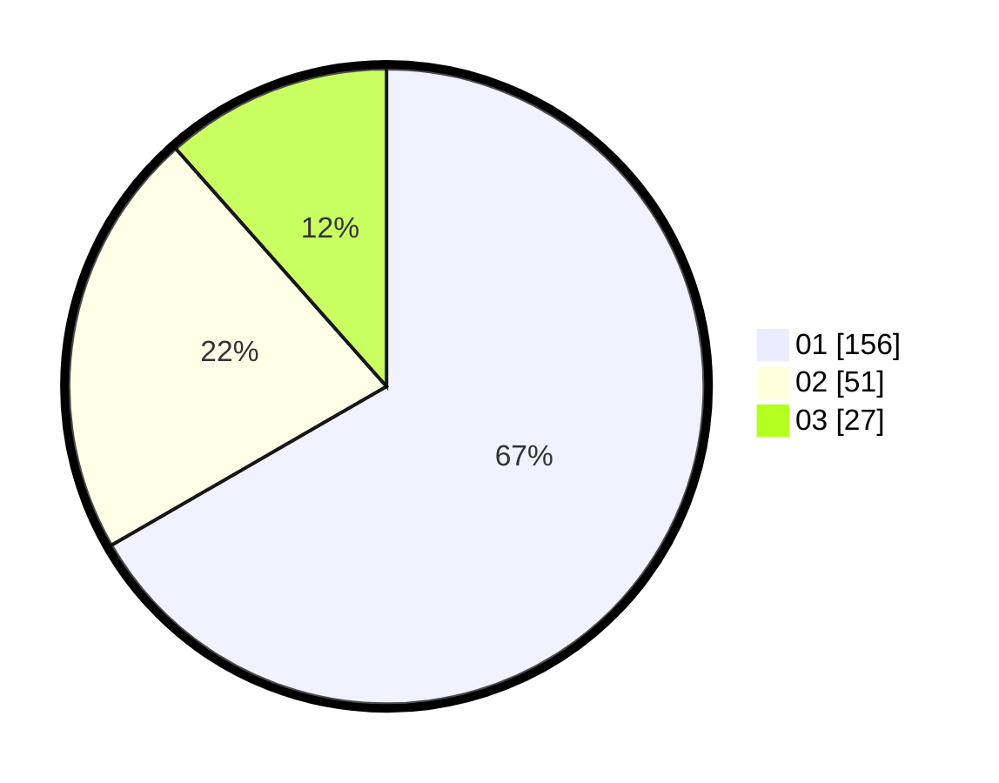

# Hasil

Hasil perolehan suara paslon dapat dilihat pada file paslon-01.txt, paslon-02.txt, dan paslon-03.txt.

Jika tidak ada, artinya data tersebut belum ada pada SIREKAP.

## Perolehan Suara

 * Paslon 01: **156**.
 * Paslon 02: **51**.
 * Paslon 03: **27**.

## Foto C Plano

https://sirekap-obj-formc.kpu.go.id/d2ed/pemilu/ppwp/31/74/08/10/04/3174081004016-20240214-192413--1e8569c5-446f-401b-8547-0610115a7c6b.jpg

https://sirekap-obj-formc.kpu.go.id/d2ed/pemilu/ppwp/31/74/08/10/04/3174081004016-20240214-192536--101ebaaa-8c23-460d-986b-2a5dc069cc0d.jpg

https://sirekap-obj-formc.kpu.go.id/d2ed/pemilu/ppwp/31/74/08/10/04/3174081004016-20240214-162229--3637285b-215f-4876-85e9-c1df439558b3.jpg

## DATA PEMILIH TETAP

Jumlah pemilih dalam DPT: **296**.
 * L: **153**.
 * P: **143**.

## DATA PENGGUNA HAK PILIH

Jumlah pengguna hak pilih dalam DPT: **235**.
 * L: **114**.
 * P: **121**.

Jumlah pengguna hak pilih dalam DPTb: **0**.
 * L: **0**.
 * P: **0**.

Jumlah pengguna hak pilih dalam DPK: **6**.
 * L: **4**.
 * P: **2**.

Jumlah pengguna hak pilih: **241**.
 * L: **118**.
 * P: **123**.

## JUMLAH SUARA SAH DAN TIDAK SAH

JUMLAH SELURUH SUARA SAH: **234**.

JUMLAH SUARA TIDAK SAH: **7**.

JUMLAH SELURUH SUARA SAH DAN SUARA TIDAK SAH: **241**.
