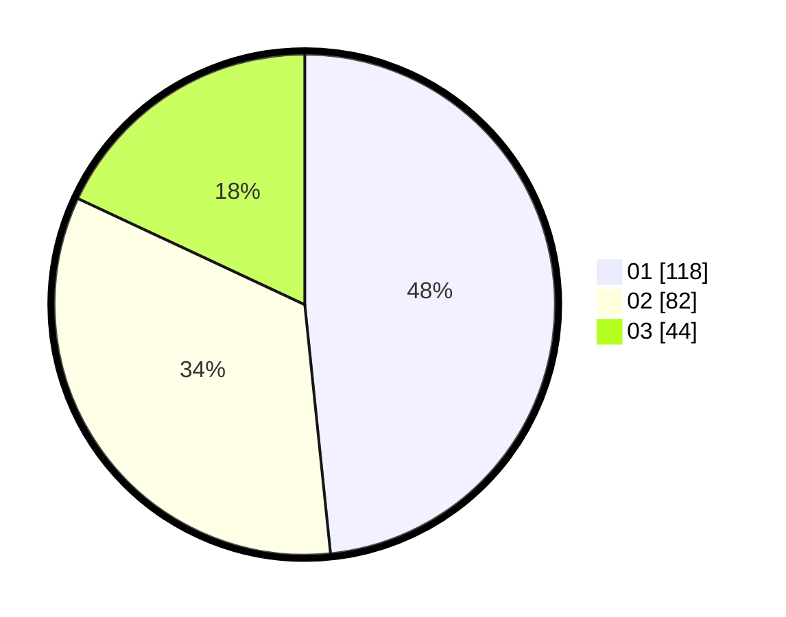

# Hasil

Hasil perolehan suara paslon dapat dilihat pada file paslon-01.txt, paslon-02.txt, dan paslon-03.txt.

Jika tidak ada, artinya data tersebut belum ada pada SIREKAP.

## Perolehan Suara

 * Paslon 01: **118**.
 * Paslon 02: **82**.
 * Paslon 03: **44**.

## Foto C Plano

https://sirekap-obj-formc.kpu.go.id/70ec/pemilu/ppwp/31/74/08/10/04/3174081004025-20240214-200308--babc7dab-2e13-4d54-b62a-8fed11a8fa1b.jpg

https://sirekap-obj-formc.kpu.go.id/70ec/pemilu/ppwp/31/74/08/10/04/3174081004025-20240214-202611--2c1d6a3c-daef-4f6b-bac1-0f52fa2adda9.jpg

https://sirekap-obj-formc.kpu.go.id/70ec/pemilu/ppwp/31/74/08/10/04/3174081004025-20240214-202614--c074d7cb-442b-4d91-b787-028386bbc514.jpg

## DATA PEMILIH TETAP

Jumlah pemilih dalam DPT: **285**.
 * L: **142**.
 * P: **143**.

## DATA PENGGUNA HAK PILIH

Jumlah pengguna hak pilih dalam DPT: **245**.
 * L: **119**.
 * P: **126**.

Jumlah pengguna hak pilih dalam DPTb: **0**.
 * L: **0**.
 * P: **0**.

Jumlah pengguna hak pilih dalam DPK: **3**.
 * L: **1**.
 * P: **2**.

Jumlah pengguna hak pilih: **248**.
 * L: **120**.
 * P: **128**.

## JUMLAH SUARA SAH DAN TIDAK SAH

JUMLAH SELURUH SUARA SAH: **244**.

JUMLAH SUARA TIDAK SAH: **4**.

JUMLAH SELURUH SUARA SAH DAN SUARA TIDAK SAH: **248**.
