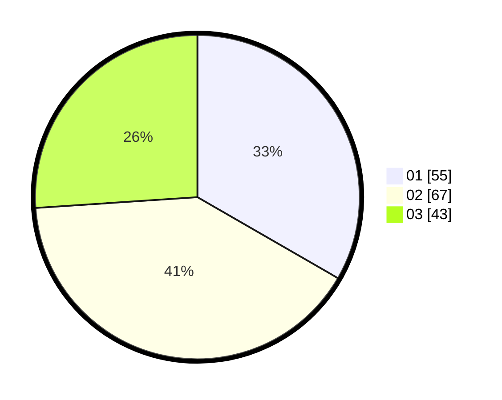

# Hasil

Hasil perolehan suara paslon dapat dilihat pada file paslon-01.txt, paslon-02.txt, dan paslon-03.txt.

Jika tidak ada, artinya data tersebut belum ada pada SIREKAP.

## Perolehan Suara

 * Paslon 01: **55**.
 * Paslon 02: **67**.
 * Paslon 03: **43**.

## Foto C Plano

https://sirekap-obj-formc.kpu.go.id/07c2/pemilu/ppwp/31/74/08/10/04/3174081004027-20240214-212108--f078a1a7-3fd2-4cad-b2ec-d273a2204899.jpg

https://sirekap-obj-formc.kpu.go.id/07c2/pemilu/ppwp/31/74/08/10/04/3174081004027-20240214-212114--74ddb26c-bca1-4c56-bd5c-b4eef7aa2c38.jpg

https://sirekap-obj-formc.kpu.go.id/07c2/pemilu/ppwp/31/74/08/10/04/3174081004027-20240214-212120--85c7b233-07cb-4b5e-a314-6135b332abe1.jpg
