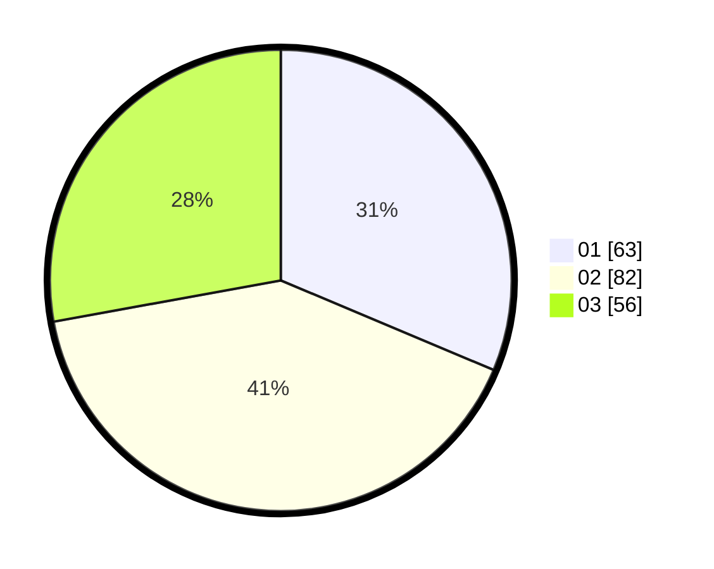

# Hasil

Hasil perolehan suara paslon dapat dilihat pada file paslon-01.txt, paslon-02.txt, dan paslon-03.txt.

Jika tidak ada, artinya data tersebut belum ada pada SIREKAP.

## Perolehan Suara

 * Paslon 01: **63**.
 * Paslon 02: **82**.
 * Paslon 03: **56**.

## Foto C Plano

https://sirekap-obj-formc.kpu.go.id/5f09/pemilu/ppwp/31/74/08/10/04/3174081004030-20240214-210004--50586fd1-d97e-4495-a9c3-3e74b64ae33f.jpg

https://sirekap-obj-formc.kpu.go.id/5f09/pemilu/ppwp/31/74/08/10/04/3174081004030-20240214-210231--9be58628-9dd6-49c5-a833-a2aa5eae9607.jpg

https://sirekap-obj-formc.kpu.go.id/5f09/pemilu/ppwp/31/74/08/10/04/3174081004030-20240214-210337--252dea9f-932b-4134-bcf8-28b1b3b4fbfc.jpg

## DATA PEMILIH TETAP

Jumlah pemilih dalam DPT: **260**.
 * L: **139**.
 * P: **121**.

## DATA PENGGUNA HAK PILIH

Jumlah pengguna hak pilih dalam DPT: **193**.
 * L: **100**.
 * P: **93**.

Jumlah pengguna hak pilih dalam DPTb: **8**.
 * L: **5**.
 * P: **3**.

Jumlah pengguna hak pilih dalam DPK: **1**.
 * L: **0**.
 * P: **1**.

Jumlah pengguna hak pilih: **202**.
 * L: **105**.
 * P: **97**.

## JUMLAH SUARA SAH DAN TIDAK SAH

JUMLAH SELURUH SUARA SAH: **201**.

JUMLAH SUARA TIDAK SAH: **1**.

JUMLAH SELURUH SUARA SAH DAN SUARA TIDAK SAH: **202**.
