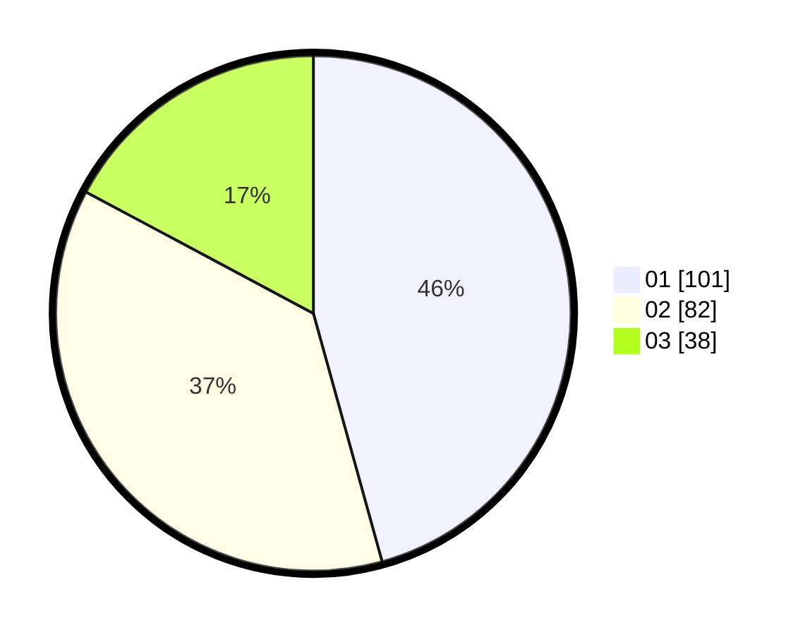

# Hasil

Hasil perolehan suara paslon dapat dilihat pada file paslon-01.txt, paslon-02.txt, dan paslon-03.txt.

Jika tidak ada, artinya data tersebut belum ada pada SIREKAP.

## Perolehan Suara

 * Paslon 01: **101**.
 * Paslon 02: **82**.
 * Paslon 03: **38**.

## Foto C Plano

https://sirekap-obj-formc.kpu.go.id/a456/pemilu/ppwp/31/74/08/10/04/3174081004048-20240216-140119--7512d3ea-831b-4d03-9047-abb281b87b78.jpg

https://sirekap-obj-formc.kpu.go.id/a456/pemilu/ppwp/31/74/08/10/04/3174081004048-20240216-140120--98efad57-7c97-4194-afe3-dadc800b9557.jpg

https://sirekap-obj-formc.kpu.go.id/a456/pemilu/ppwp/31/74/08/10/04/3174081004048-20240216-140119--f25c1c19-0ae2-427b-9f43-0aec7b05d8ea.jpg

## DATA PEMILIH TETAP

Jumlah pemilih dalam DPT: **280**.
 * L: **132**.
 * P: **148**.

## DATA PENGGUNA HAK PILIH

Jumlah pengguna hak pilih dalam DPT: **216**.
 * L: **95**.
 * P: **121**.

Jumlah pengguna hak pilih dalam DPTb: **9**.
 * L: **0**.
 * P: **9**.

Jumlah pengguna hak pilih dalam DPK: **0**.
 * L: **0**.
 * P: **0**.

Jumlah pengguna hak pilih: **225**.
 * L: **95**.
 * P: **130**.

## JUMLAH SUARA SAH DAN TIDAK SAH

JUMLAH SELURUH SUARA SAH: **221**.

JUMLAH SUARA TIDAK SAH: **4**.

JUMLAH SELURUH SUARA SAH DAN SUARA TIDAK SAH: **225**.
