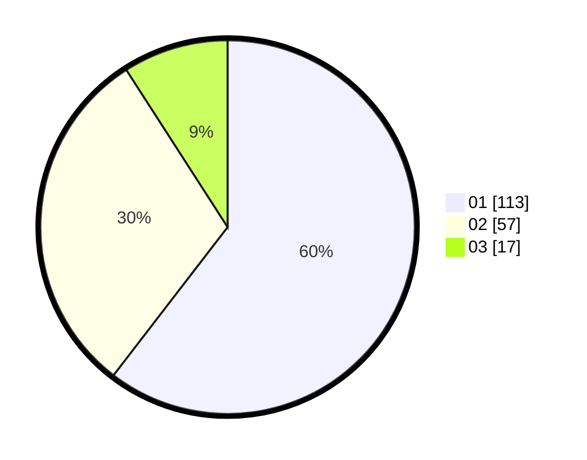

# Hasil

Hasil perolehan suara paslon dapat dilihat pada file paslon-01.txt, paslon-02.txt, dan paslon-03.txt.

Jika tidak ada, artinya data tersebut belum ada pada SIREKAP.

## Perolehan Suara

 * Paslon 01: **113**.
 * Paslon 02: **57**.
 * Paslon 03: **17**.

## Foto C Plano

https://sirekap-obj-formc.kpu.go.id/a703/pemilu/ppwp/31/74/08/10/04/3174081004052-20240214-191122--ec8c8838-bb90-4df9-8f98-6f6dcb849b02.jpg

https://sirekap-obj-formc.kpu.go.id/a703/pemilu/ppwp/31/74/08/10/04/3174081004052-20240214-191134--7a3efc57-0af7-42aa-a181-9e2d727e207f.jpg

https://sirekap-obj-formc.kpu.go.id/a703/pemilu/ppwp/31/74/08/10/04/3174081004052-20240214-191151--e94a52a8-f089-49e9-8006-0c487fb74136.jpg

## DATA PEMILIH TETAP

Jumlah pemilih dalam DPT: **236**.
 * L: **121**.
 * P: **115**.

## DATA PENGGUNA HAK PILIH

Jumlah pengguna hak pilih dalam DPT: **185**.
 * L: **95**.
 * P: **90**.

Jumlah pengguna hak pilih dalam DPTb: **2**.
 * L: **1**.
 * P: **1**.

Jumlah pengguna hak pilih dalam DPK: **1**.
 * L: **0**.
 * P: **1**.

Jumlah pengguna hak pilih: **188**.
 * L: **96**.
 * P: **92**.

## JUMLAH SUARA SAH DAN TIDAK SAH

JUMLAH SELURUH SUARA SAH: **187**.

JUMLAH SUARA TIDAK SAH: **1**.

JUMLAH SELURUH SUARA SAH DAN SUARA TIDAK SAH: **188**.
