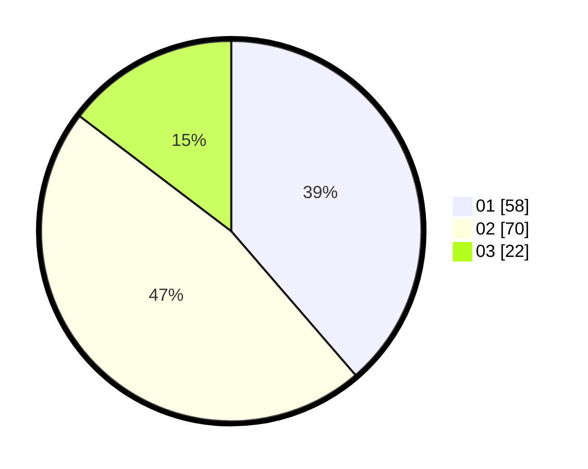

# Hasil

Hasil perolehan suara paslon dapat dilihat pada file paslon-01.txt, paslon-02.txt, dan paslon-03.txt.

Jika tidak ada, artinya data tersebut belum ada pada SIREKAP.

## Perolehan Suara

 * Paslon 01: **58**.
 * Paslon 02: **70**.
 * Paslon 03: **22**.

## Foto C Plano

https://sirekap-obj-formc.kpu.go.id/47b1/pemilu/ppwp/31/74/08/10/04/3174081004057-20240214-155635--5df99d59-171a-4d2d-8237-8e7298570107.jpg

https://sirekap-obj-formc.kpu.go.id/47b1/pemilu/ppwp/31/74/08/10/04/3174081004057-20240214-155502--b93595c1-7edb-4b93-9034-8026f320a280.jpg

https://sirekap-obj-formc.kpu.go.id/47b1/pemilu/ppwp/31/74/08/10/04/3174081004057-20240214-155731--58bba862-ee53-4244-9ed6-4f8d82a31ef4.jpg

## DATA PEMILIH TETAP

Jumlah pemilih dalam DPT: **204**.
 * L: **101**.
 * P: **103**.

## DATA PENGGUNA HAK PILIH

Jumlah pengguna hak pilih dalam DPT: **155**.
 * L: **70**.
 * P: **85**.

Jumlah pengguna hak pilih dalam DPTb: **3**.
 * L: **2**.
 * P: **1**.

Jumlah pengguna hak pilih dalam DPK: **1**.
 * L: **1**.
 * P: **0**.

Jumlah pengguna hak pilih: **159**.
 * L: **73**.
 * P: **86**.

## JUMLAH SUARA SAH DAN TIDAK SAH

JUMLAH SELURUH SUARA SAH: **150**.

JUMLAH SUARA TIDAK SAH: **9**.

JUMLAH SELURUH SUARA SAH DAN SUARA TIDAK SAH: **159**.
