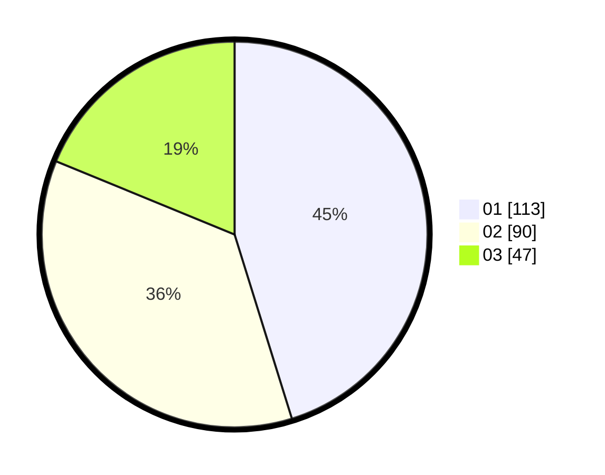

# Hasil

Hasil perolehan suara paslon dapat dilihat pada file paslon-01.txt, paslon-02.txt, dan paslon-03.txt.

Jika tidak ada, artinya data tersebut belum ada pada SIREKAP.

## Perolehan Suara

 * Paslon 01: **113**.
 * Paslon 02: **90**.
 * Paslon 03: **47**.

## Foto C Plano

https://sirekap-obj-formc.kpu.go.id/fa4e/pemilu/ppwp/31/74/08/10/04/3174081004064-20240215-085822--daaff074-5054-415a-ba1c-d89a1e815d03.jpg

https://sirekap-obj-formc.kpu.go.id/fa4e/pemilu/ppwp/31/74/08/10/04/3174081004064-20240215-085846--485083cc-056b-4948-aa95-0223bcfe15ab.jpg

https://sirekap-obj-formc.kpu.go.id/fa4e/pemilu/ppwp/31/74/08/10/04/3174081004064-20240215-085833--7caa0289-cbe9-45ed-ab76-9810c46f7496.jpg

## DATA PEMILIH TETAP

Jumlah pemilih dalam DPT: **292**.
 * L: **144**.
 * P: **154**.

## DATA PENGGUNA HAK PILIH

Jumlah pengguna hak pilih dalam DPT: **232**.
 * L: **111**.
 * P: **121**.

Jumlah pengguna hak pilih dalam DPTb: **21**.
 * L: **8**.
 * P: **13**.

Jumlah pengguna hak pilih dalam DPK: **1**.
 * L: **0**.
 * P: **1**.

Jumlah pengguna hak pilih: **254**.
 * L: **119**.
 * P: **135**.

## JUMLAH SUARA SAH DAN TIDAK SAH

JUMLAH SELURUH SUARA SAH: **250**.

JUMLAH SUARA TIDAK SAH: **2**.

JUMLAH SELURUH SUARA SAH DAN SUARA TIDAK SAH: **252**.
