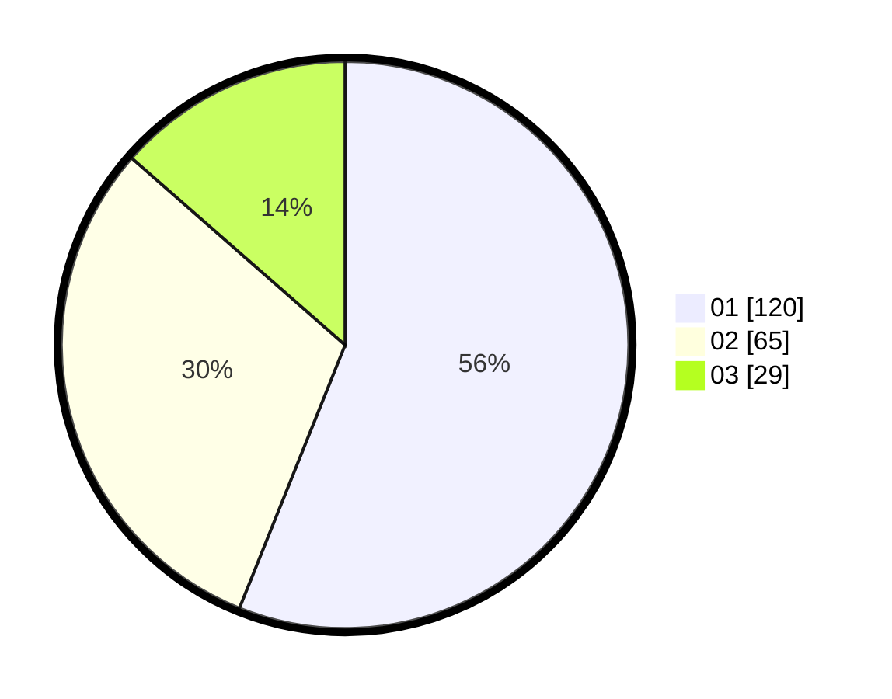

# Hasil

Hasil perolehan suara paslon dapat dilihat pada file paslon-01.txt, paslon-02.txt, dan paslon-03.txt.

Jika tidak ada, artinya data tersebut belum ada pada SIREKAP.

## Perolehan Suara

 * Paslon 01: **120**.
 * Paslon 02: **65**.
 * Paslon 03: **29**.

## Foto C Plano

https://sirekap-obj-formc.kpu.go.id/4797/pemilu/ppwp/31/74/08/10/04/3174081004072-20240216-020007--ec88976e-ceff-4f02-8f44-fa36412eae24.jpg

https://sirekap-obj-formc.kpu.go.id/4797/pemilu/ppwp/31/74/08/10/04/3174081004072-20240216-020025--995e8fe6-5268-485e-b7d5-b1c809a4039f.jpg

https://sirekap-obj-formc.kpu.go.id/4797/pemilu/ppwp/31/74/08/10/04/3174081004072-20240216-020444--177a40c3-573f-4de4-8a92-373867c6b733.jpg

## DATA PEMILIH TETAP

Jumlah pemilih dalam DPT: **255**.
 * L: **129**.
 * P: **126**.

## DATA PENGGUNA HAK PILIH

Jumlah pengguna hak pilih dalam DPT: **212**.
 * L: **104**.
 * P: **108**.

Jumlah pengguna hak pilih dalam DPTb: **3**.
 * L: **0**.
 * P: **3**.

Jumlah pengguna hak pilih dalam DPK: **0**.
 * L: **0**.
 * P: **0**.

Jumlah pengguna hak pilih: **215**.
 * L: **104**.
 * P: **111**.

## JUMLAH SUARA SAH DAN TIDAK SAH

JUMLAH SELURUH SUARA SAH: **214**.

JUMLAH SUARA TIDAK SAH: **1**.

JUMLAH SELURUH SUARA SAH DAN SUARA TIDAK SAH: **215**.
