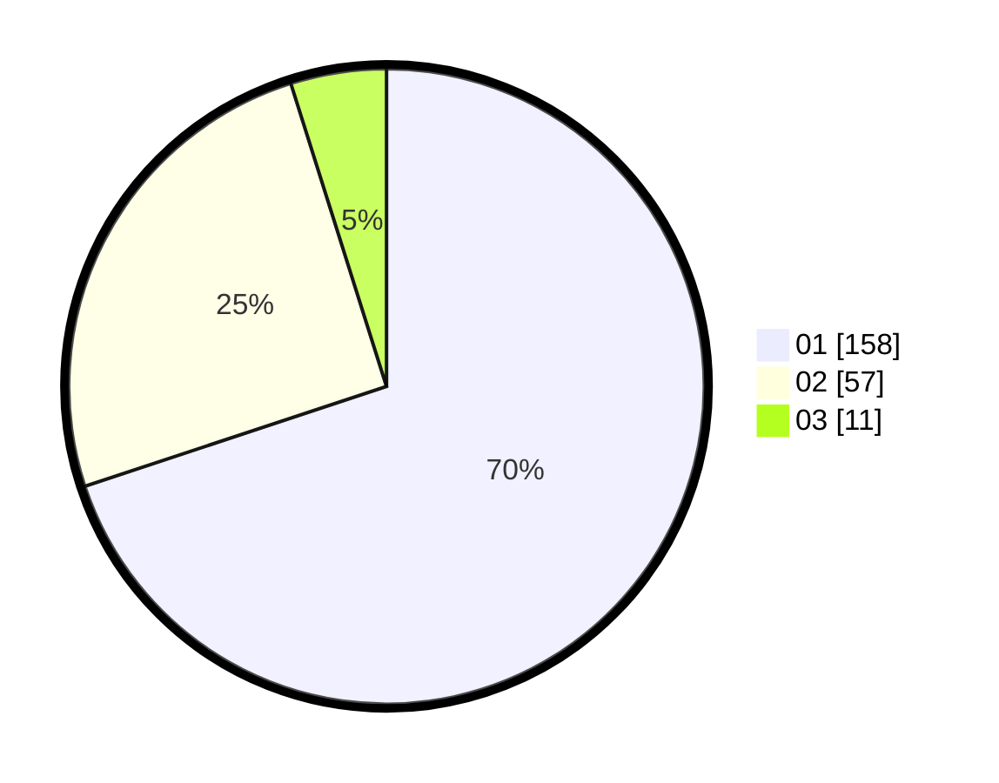

# Hasil

Hasil perolehan suara paslon dapat dilihat pada file paslon-01.txt, paslon-02.txt, dan paslon-03.txt.

Jika tidak ada, artinya data tersebut belum ada pada SIREKAP.

## Perolehan Suara

 * Paslon 01: **158**.
 * Paslon 02: **57**.
 * Paslon 03: **11**.

## Foto C Plano

https://sirekap-obj-formc.kpu.go.id/60ee/pemilu/ppwp/31/74/08/10/04/3174081004073-20240216-030607--fd6b6014-61c0-4ff2-bc44-1c94786eb540.jpg

https://sirekap-obj-formc.kpu.go.id/60ee/pemilu/ppwp/31/74/08/10/04/3174081004073-20240216-030627--804e51af-f340-4359-9083-bc6c1863554c.jpg

https://sirekap-obj-formc.kpu.go.id/60ee/pemilu/ppwp/31/74/08/10/04/3174081004073-20240216-042236--bccfcaf5-8627-4469-a832-e7a2dfd80a74.jpg

## DATA PEMILIH TETAP

Jumlah pemilih dalam DPT: **274**.
 * L: **145**.
 * P: **129**.

## DATA PENGGUNA HAK PILIH

Jumlah pengguna hak pilih dalam DPT: **220**.
 * L: **112**.
 * P: **108**.

Jumlah pengguna hak pilih dalam DPTb: **3**.
 * L: **1**.
 * P: **2**.

Jumlah pengguna hak pilih dalam DPK: **5**.
 * L: **3**.
 * P: **2**.

Jumlah pengguna hak pilih: **228**.
 * L: **116**.
 * P: **112**.

## JUMLAH SUARA SAH DAN TIDAK SAH

JUMLAH SELURUH SUARA SAH: **226**.

JUMLAH SUARA TIDAK SAH: **2**.

JUMLAH SELURUH SUARA SAH DAN SUARA TIDAK SAH: **228**.
