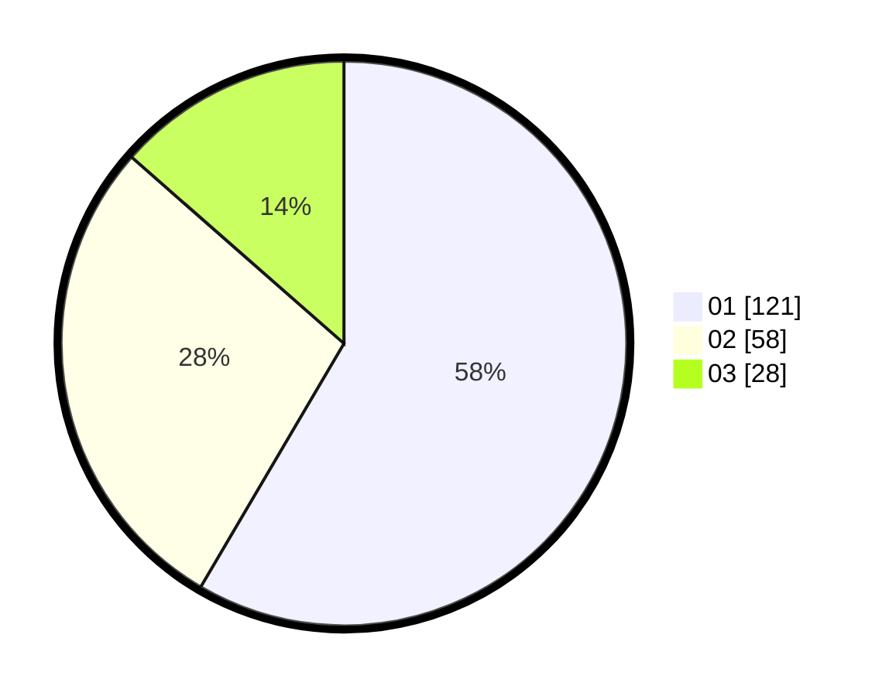

# Hasil

Hasil perolehan suara paslon dapat dilihat pada file paslon-01.txt, paslon-02.txt, dan paslon-03.txt.

Jika tidak ada, artinya data tersebut belum ada pada SIREKAP.

## Perolehan Suara

 * Paslon 01: **121**.
 * Paslon 02: **58**.
 * Paslon 03: **28**.

## Foto C Plano

https://sirekap-obj-formc.kpu.go.id/0a3f/pemilu/ppwp/31/74/08/10/04/3174081004080-20240214-155436--11b1861c-669f-4b4a-87cb-350793c49e9b.jpg

https://sirekap-obj-formc.kpu.go.id/0a3f/pemilu/ppwp/31/74/08/10/04/3174081004080-20240214-155515--5854f4d2-5d61-47ab-b051-b38536c5859a.jpg

https://sirekap-obj-formc.kpu.go.id/0a3f/pemilu/ppwp/31/74/08/10/04/3174081004080-20240214-155538--7d36828e-963f-40f2-b4e0-a7689ccc2b09.jpg

## DATA PEMILIH TETAP

Jumlah pemilih dalam DPT: **242**.
 * L: **119**.
 * P: **123**.

## DATA PENGGUNA HAK PILIH

Jumlah pengguna hak pilih dalam DPT: **205**.
 * L: **97**.
 * P: **109**.

Jumlah pengguna hak pilih dalam DPTb: **2**.
 * L: **1**.
 * P: **1**.

Jumlah pengguna hak pilih dalam DPK: **0**.
 * L: **0**.
 * P: **0**.

Jumlah pengguna hak pilih: **208**.
 * L: **74**.
 * P: **110**.

## JUMLAH SUARA SAH DAN TIDAK SAH

JUMLAH SELURUH SUARA SAH: **207**.

JUMLAH SUARA TIDAK SAH: **1**.

JUMLAH SELURUH SUARA SAH DAN SUARA TIDAK SAH: **208**.
