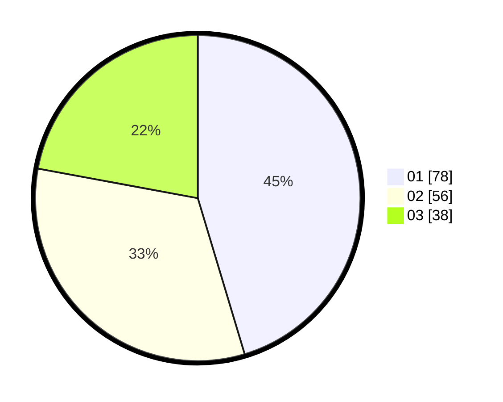

# Hasil

Hasil perolehan suara paslon dapat dilihat pada file paslon-01.txt, paslon-02.txt, dan paslon-03.txt.

Jika tidak ada, artinya data tersebut belum ada pada SIREKAP.

## Perolehan Suara

 * Paslon 01: **78**.
 * Paslon 02: **56**.
 * Paslon 03: **38**.

## Foto C Plano

https://sirekap-obj-formc.kpu.go.id/fac0/pemilu/ppwp/31/74/08/10/04/3174081004088-20240214-230816--15979c25-1393-4197-91f2-62284af91541.jpg

https://sirekap-obj-formc.kpu.go.id/fac0/pemilu/ppwp/31/74/08/10/04/3174081004088-20240214-155728--78db11bb-16ac-4b5b-b0e3-bdcaaf132750.jpg

https://sirekap-obj-formc.kpu.go.id/fac0/pemilu/ppwp/31/74/08/10/04/3174081004088-20240214-155807--c3db4e0c-c233-4f6e-802c-c06fa23d42c8.jpg

## DATA PEMILIH TETAP

Jumlah pemilih dalam DPT: **214**.
 * L: **106**.
 * P: **108**.

## DATA PENGGUNA HAK PILIH

Jumlah pengguna hak pilih dalam DPT: **163**.
 * L: **76**.
 * P: **87**.

Jumlah pengguna hak pilih dalam DPTb: **6**.
 * L: **1**.
 * P: **5**.

Jumlah pengguna hak pilih dalam DPK: **7**.
 * L: **3**.
 * P: **4**.

Jumlah pengguna hak pilih: **176**.
 * L: **80**.
 * P: **96**.

## JUMLAH SUARA SAH DAN TIDAK SAH

JUMLAH SELURUH SUARA SAH: **172**.

JUMLAH SUARA TIDAK SAH: **4**.

JUMLAH SELURUH SUARA SAH DAN SUARA TIDAK SAH: **176**.
