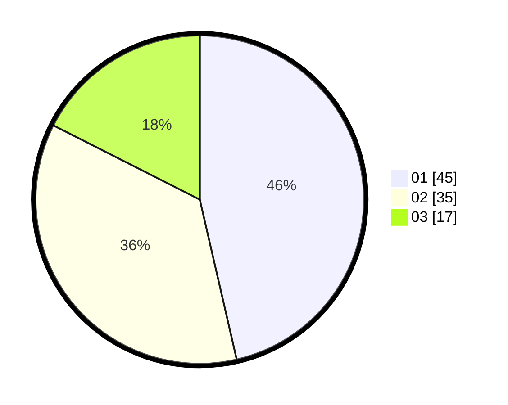

# Hasil

Hasil perolehan suara paslon dapat dilihat pada file paslon-01.txt, paslon-02.txt, dan paslon-03.txt.

Jika tidak ada, artinya data tersebut belum ada pada SIREKAP.

## Perolehan Suara

 * Paslon 01: **45**.
 * Paslon 02: **35**.
 * Paslon 03: **17**.

## Foto C Plano

https://sirekap-obj-formc.kpu.go.id/0d6f/pemilu/ppwp/31/74/08/10/04/3174081004089-20240214-230352--0620c9a2-35a2-4bc1-b3ab-fd9ace02e1e8.jpg

https://sirekap-obj-formc.kpu.go.id/0d6f/pemilu/ppwp/31/74/08/10/04/3174081004089-20240214-231653--bef744f9-d2e6-4aa1-bbfe-3870fb76fb44.jpg

https://sirekap-obj-formc.kpu.go.id/0d6f/pemilu/ppwp/31/74/08/10/04/3174081004089-20240216-121506--d7ddf4c2-52e9-4c87-8aa4-d6389f70c161.jpg

## DATA PEMILIH TETAP

Jumlah pemilih dalam DPT: **121**.
 * L: **56**.
 * P: **65**.

## DATA PENGGUNA HAK PILIH

Jumlah pengguna hak pilih dalam DPT: **89**.
 * L: **38**.
 * P: **51**.

Jumlah pengguna hak pilih dalam DPTb: **5**.
 * L: **3**.
 * P: **2**.

Jumlah pengguna hak pilih dalam DPK: **3**.
 * L: **0**.
 * P: **3**.

Jumlah pengguna hak pilih: **97**.
 * L: **41**.
 * P: **56**.

## JUMLAH SUARA SAH DAN TIDAK SAH

JUMLAH SELURUH SUARA SAH: **97**.

JUMLAH SUARA TIDAK SAH: **0**.

JUMLAH SELURUH SUARA SAH DAN SUARA TIDAK SAH: **97**.
