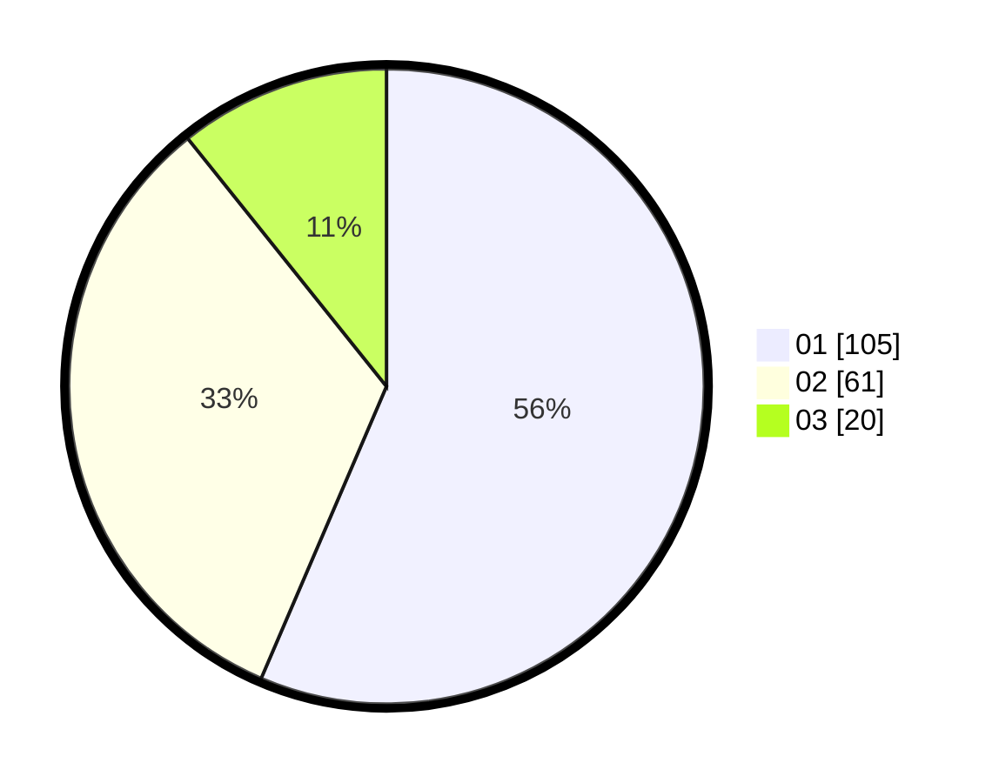

# Hasil

Hasil perolehan suara paslon dapat dilihat pada file paslon-01.txt, paslon-02.txt, dan paslon-03.txt.

Jika tidak ada, artinya data tersebut belum ada pada SIREKAP.

## Perolehan Suara

 * Paslon 01: **105**.
 * Paslon 02: **61**.
 * Paslon 03: **20**.

## Foto C Plano

https://sirekap-obj-formc.kpu.go.id/0be4/pemilu/ppwp/31/74/08/10/04/3174081004095-20240214-194408--3514f096-7b05-48bd-90fc-c21f3b126258.jpg

https://sirekap-obj-formc.kpu.go.id/0be4/pemilu/ppwp/31/74/08/10/04/3174081004095-20240214-194444--5bcffe7d-ef0a-45b2-9b41-53d41dd7fca2.jpg

https://sirekap-obj-formc.kpu.go.id/0be4/pemilu/ppwp/31/74/08/10/04/3174081004095-20240214-194525--bddb3835-8690-475a-bbeb-0c0d52295f71.jpg

## DATA PEMILIH TETAP

Jumlah pemilih dalam DPT: **239**.
 * L: **124**.
 * P: **115**.

## DATA PENGGUNA HAK PILIH

Jumlah pengguna hak pilih dalam DPT: **182**.
 * L: **91**.
 * P: **91**.

Jumlah pengguna hak pilih dalam DPTb: **5**.
 * L: **2**.
 * P: **3**.

Jumlah pengguna hak pilih dalam DPK: **3**.
 * L: **3**.
 * P: **0**.

Jumlah pengguna hak pilih: **190**.
 * L: **96**.
 * P: **94**.

## JUMLAH SUARA SAH DAN TIDAK SAH

JUMLAH SELURUH SUARA SAH: **186**.

JUMLAH SUARA TIDAK SAH: **6**.

JUMLAH SELURUH SUARA SAH DAN SUARA TIDAK SAH: **192**.
