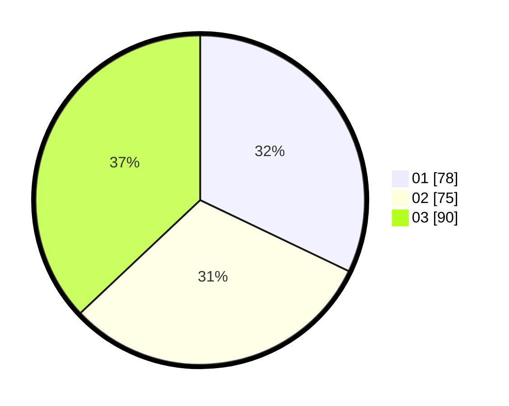

# Hasil

Hasil perolehan suara paslon dapat dilihat pada file paslon-01.txt, paslon-02.txt, dan paslon-03.txt.

Jika tidak ada, artinya data tersebut belum ada pada SIREKAP.

## Perolehan Suara

 * Paslon 01: **78**.
 * Paslon 02: **75**.
 * Paslon 03: **90**.

## Foto C Plano

https://sirekap-obj-formc.kpu.go.id/5d29/pemilu/ppwp/31/74/08/10/04/3174081004101-20240214-202939--a65b08bf-eaca-47fc-ae70-d8e30422c276.jpg

https://sirekap-obj-formc.kpu.go.id/5d29/pemilu/ppwp/31/74/08/10/04/3174081004101-20240214-212210--75fdb299-109e-42c2-b316-378491aab81d.jpg

https://sirekap-obj-formc.kpu.go.id/5d29/pemilu/ppwp/31/74/08/10/04/3174081004101-20240214-212314--091da203-0ef2-42bf-839e-8f49d242011c.jpg
