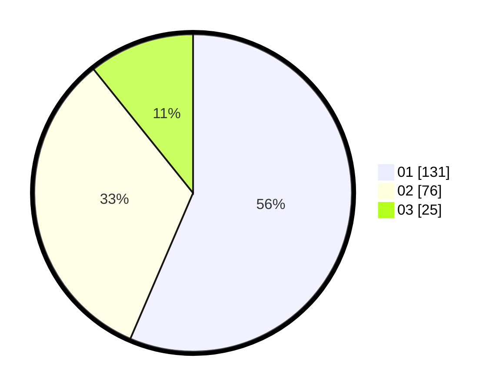

# Hasil

Hasil perolehan suara paslon dapat dilihat pada file paslon-01.txt, paslon-02.txt, dan paslon-03.txt.

Jika tidak ada, artinya data tersebut belum ada pada SIREKAP.

## Perolehan Suara

 * Paslon 01: **131**.
 * Paslon 02: **76**.
 * Paslon 03: **25**.

## Foto C Plano

https://sirekap-obj-formc.kpu.go.id/1891/pemilu/ppwp/31/74/08/10/05/3174081005001-20240217-140125--9f9d768e-5ed9-4b22-80cd-aad18f51ebbf.jpg

https://sirekap-obj-formc.kpu.go.id/1891/pemilu/ppwp/31/74/08/10/05/3174081005001-20240217-140323--6b32e5db-18a2-4ac8-9313-5a8eb1890ec3.jpg

https://sirekap-obj-formc.kpu.go.id/1891/pemilu/ppwp/31/74/08/10/05/3174081005001-20240217-140450--67a45b3a-b8ff-47b4-85ea-ce926f894ba1.jpg

## DATA PEMILIH TETAP

Jumlah pemilih dalam DPT: **277**.
 * L: **131**.
 * P: **146**.

## DATA PENGGUNA HAK PILIH

Jumlah pengguna hak pilih dalam DPT: **214**.
 * L: **106**.
 * P: **108**.

Jumlah pengguna hak pilih dalam DPTb: **64**.
 * L: **5**.
 * P: **12**.

Jumlah pengguna hak pilih dalam DPK: **4**.
 * L: **3**.
 * P: **1**.

Jumlah pengguna hak pilih: **234**.
 * L: **114**.
 * P: **121**.

## JUMLAH SUARA SAH DAN TIDAK SAH

JUMLAH SELURUH SUARA SAH: **232**.

JUMLAH SUARA TIDAK SAH: **3**.

JUMLAH SELURUH SUARA SAH DAN SUARA TIDAK SAH: **235**.
