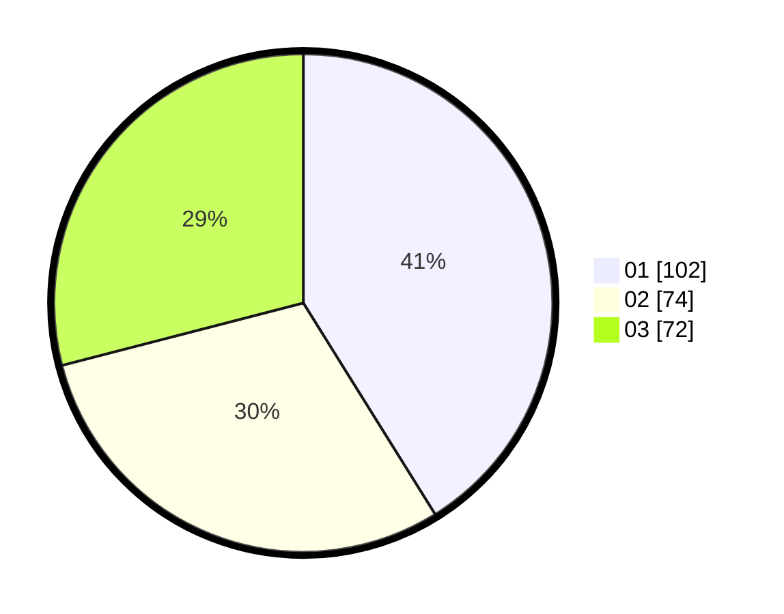

# Hasil

Hasil perolehan suara paslon dapat dilihat pada file paslon-01.txt, paslon-02.txt, dan paslon-03.txt.

Jika tidak ada, artinya data tersebut belum ada pada SIREKAP.

## Perolehan Suara

 * Paslon 01: **102**.
 * Paslon 02: **74**.
 * Paslon 03: **72**.

## Foto C Plano

https://sirekap-obj-formc.kpu.go.id/9bb0/pemilu/ppwp/31/74/08/10/05/3174081005002-20240217-163956--c054c33d-56ed-4d8a-8c7e-e15159bc1266.jpg

https://sirekap-obj-formc.kpu.go.id/9bb0/pemilu/ppwp/31/74/08/10/05/3174081005002-20240217-164053--d946c31e-eedd-414d-ad04-5fb2f9c333bc.jpg

https://sirekap-obj-formc.kpu.go.id/9bb0/pemilu/ppwp/31/74/08/10/05/3174081005002-20240217-164137--35e83c4c-38f9-4e86-9e96-1fcd005bd11b.jpg

## DATA PEMILIH TETAP

Jumlah pemilih dalam DPT: **292**.
 * L: **139**.
 * P: **153**.

## DATA PENGGUNA HAK PILIH

Jumlah pengguna hak pilih dalam DPT: **218**.
 * L: **105**.
 * P: **113**.

Jumlah pengguna hak pilih dalam DPTb: **23**.
 * L: **11**.
 * P: **22**.

Jumlah pengguna hak pilih dalam DPK: **7**.
 * L: **3**.
 * P: **4**.

Jumlah pengguna hak pilih: **248**.
 * L: **119**.
 * P: **129**.

## JUMLAH SUARA SAH DAN TIDAK SAH

JUMLAH SELURUH SUARA SAH: **248**.

JUMLAH SUARA TIDAK SAH: **1**.

JUMLAH SELURUH SUARA SAH DAN SUARA TIDAK SAH: **249**.
