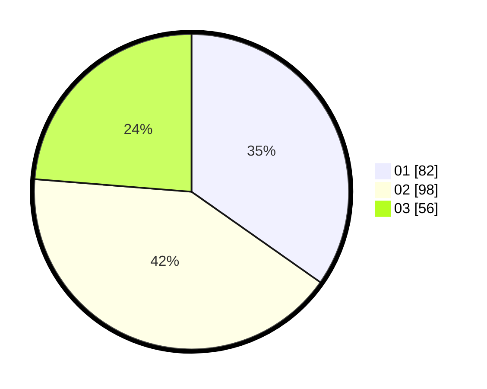

# Hasil

Hasil perolehan suara paslon dapat dilihat pada file paslon-01.txt, paslon-02.txt, dan paslon-03.txt.

Jika tidak ada, artinya data tersebut belum ada pada SIREKAP.

## Perolehan Suara

 * Paslon 01: **82**.
 * Paslon 02: **98**.
 * Paslon 03: **56**.

## Foto C Plano

https://sirekap-obj-formc.kpu.go.id/7664/pemilu/ppwp/31/74/08/10/05/3174081005003-20240217-201949--b4c4b44c-2359-4892-8f76-b24a84ac1ff3.jpg

https://sirekap-obj-formc.kpu.go.id/7664/pemilu/ppwp/31/74/08/10/05/3174081005003-20240217-202154--b0beafab-d5d1-474e-a3ba-37ab310e44ed.jpg

https://sirekap-obj-formc.kpu.go.id/7664/pemilu/ppwp/31/74/08/10/05/3174081005003-20240217-202241--b4a4177f-a1b2-4033-bada-8aa3a287945f.jpg

## DATA PEMILIH TETAP

Jumlah pemilih dalam DPT: **290**.
 * L: **132**.
 * P: **158**.

## DATA PENGGUNA HAK PILIH

Jumlah pengguna hak pilih dalam DPT: **204**.
 * L: **96**.
 * P: **108**.

Jumlah pengguna hak pilih dalam DPTb: **27**.
 * L: **12**.
 * P: **15**.

Jumlah pengguna hak pilih dalam DPK: **9**.
 * L: **3**.
 * P: **6**.

Jumlah pengguna hak pilih: **240**.
 * L: **111**.
 * P: **129**.

## JUMLAH SUARA SAH DAN TIDAK SAH

JUMLAH SELURUH SUARA SAH: **236**.

JUMLAH SUARA TIDAK SAH: **4**.

JUMLAH SELURUH SUARA SAH DAN SUARA TIDAK SAH: **240**.
