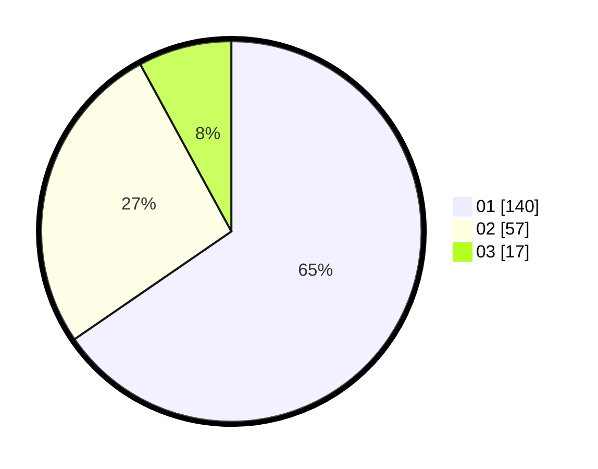

# Hasil

Hasil perolehan suara paslon dapat dilihat pada file paslon-01.txt, paslon-02.txt, dan paslon-03.txt.

Jika tidak ada, artinya data tersebut belum ada pada SIREKAP.

## Perolehan Suara

 * Paslon 01: **140**.
 * Paslon 02: **57**.
 * Paslon 03: **17**.

## Foto C Plano

https://sirekap-obj-formc.kpu.go.id/8987/pemilu/ppwp/31/74/08/10/05/3174081005014-20240218-154431--a4906761-f516-45a0-8f60-9168ecdfd2fa.jpg

https://sirekap-obj-formc.kpu.go.id/8987/pemilu/ppwp/31/74/08/10/05/3174081005014-20240218-154433--eeefa4d2-dc7d-4688-bc46-bf2d04b2c3d0.jpg

https://sirekap-obj-formc.kpu.go.id/8987/pemilu/ppwp/31/74/08/10/05/3174081005014-20240218-154432--baf73e6f-84ed-4679-984f-07c6c3075715.jpg

## DATA PEMILIH TETAP

Jumlah pemilih dalam DPT: **249**.
 * L: **127**.
 * P: **122**.

## DATA PENGGUNA HAK PILIH

Jumlah pengguna hak pilih dalam DPT: **210**.
 * L: **103**.
 * P: **107**.

Jumlah pengguna hak pilih dalam DPTb: **0**.
 * L: **0**.
 * P: **0**.

Jumlah pengguna hak pilih dalam DPK: **5**.
 * L: **3**.
 * P: **2**.

Jumlah pengguna hak pilih: **215**.
 * L: **106**.
 * P: **109**.

## JUMLAH SUARA SAH DAN TIDAK SAH

JUMLAH SELURUH SUARA SAH: **214**.

JUMLAH SUARA TIDAK SAH: **1**.

JUMLAH SELURUH SUARA SAH DAN SUARA TIDAK SAH: **215**.
