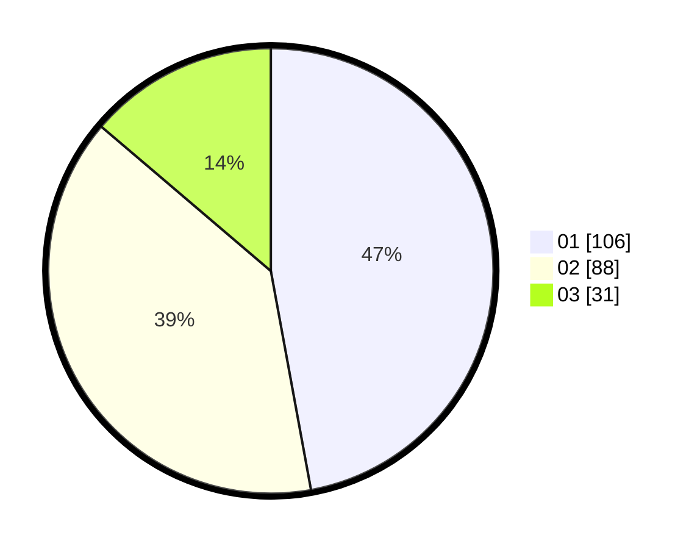

# Hasil

Hasil perolehan suara paslon dapat dilihat pada file paslon-01.txt, paslon-02.txt, dan paslon-03.txt.

Jika tidak ada, artinya data tersebut belum ada pada SIREKAP.

## Perolehan Suara

 * Paslon 01: **106**.
 * Paslon 02: **88**.
 * Paslon 03: **31**.

## Foto C Plano

https://sirekap-obj-formc.kpu.go.id/022e/pemilu/ppwp/31/74/08/10/05/3174081005016-20240214-155123--ff6db31e-4f0e-48c0-8ba5-7074175faf5a.jpg

https://sirekap-obj-formc.kpu.go.id/022e/pemilu/ppwp/31/74/08/10/05/3174081005016-20240214-155105--735c2d79-d679-4329-a6d4-0825f25fd196.jpg

https://sirekap-obj-formc.kpu.go.id/022e/pemilu/ppwp/31/74/08/10/05/3174081005016-20240214-155044--cc8f26cc-c9b9-4b45-b7d4-155437101490.jpg

## DATA PEMILIH TETAP

Jumlah pemilih dalam DPT: **286**.
 * L: **149**.
 * P: **137**.

## DATA PENGGUNA HAK PILIH

Jumlah pengguna hak pilih dalam DPT: **231**.
 * L: **131**.
 * P: **100**.

Jumlah pengguna hak pilih dalam DPTb: **0**.
 * L: **0**.
 * P: **0**.

Jumlah pengguna hak pilih dalam DPK: **0**.
 * L: **0**.
 * P: **0**.

Jumlah pengguna hak pilih: **231**.
 * L: **131**.
 * P: **100**.

## JUMLAH SUARA SAH DAN TIDAK SAH

JUMLAH SELURUH SUARA SAH: **225**.

JUMLAH SUARA TIDAK SAH: **6**.

JUMLAH SELURUH SUARA SAH DAN SUARA TIDAK SAH: **231**.
