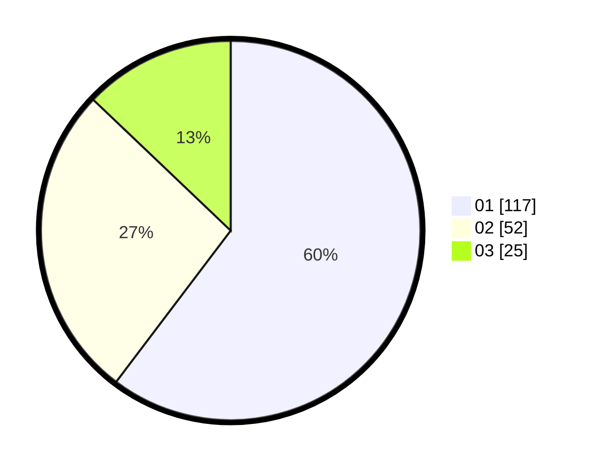

# Hasil

Hasil perolehan suara paslon dapat dilihat pada file paslon-01.txt, paslon-02.txt, dan paslon-03.txt.

Jika tidak ada, artinya data tersebut belum ada pada SIREKAP.

## Perolehan Suara

 * Paslon 01: **117**.
 * Paslon 02: **52**.
 * Paslon 03: **25**.

## Foto C Plano

https://sirekap-obj-formc.kpu.go.id/110a/pemilu/ppwp/31/74/08/10/05/3174081005021-20240219-212830--dd91b295-c408-4864-b96d-39bd1799e039.jpg

https://sirekap-obj-formc.kpu.go.id/110a/pemilu/ppwp/31/74/08/10/05/3174081005021-20240219-213334--2d3acaaf-7ef8-495e-ab38-830a27100477.jpg

https://sirekap-obj-formc.kpu.go.id/110a/pemilu/ppwp/31/74/08/10/05/3174081005021-20240219-213600--a0107d41-d738-4131-ac3a-d63aa804ee27.jpg

## DATA PEMILIH TETAP

Jumlah pemilih dalam DPT: **260**.
 * L: **118**.
 * P: **142**.

## DATA PENGGUNA HAK PILIH

Jumlah pengguna hak pilih dalam DPT: **194**.
 * L: **84**.
 * P: **110**.

Jumlah pengguna hak pilih dalam DPTb: **1**.
 * L: **0**.
 * P: **1**.

Jumlah pengguna hak pilih dalam DPK: **4**.
 * L: **2**.
 * P: **2**.

Jumlah pengguna hak pilih: **199**.
 * L: **86**.
 * P: **113**.

## JUMLAH SUARA SAH DAN TIDAK SAH

JUMLAH SELURUH SUARA SAH: **145**.

JUMLAH SUARA TIDAK SAH: **4**.

JUMLAH SELURUH SUARA SAH DAN SUARA TIDAK SAH: **199**.
