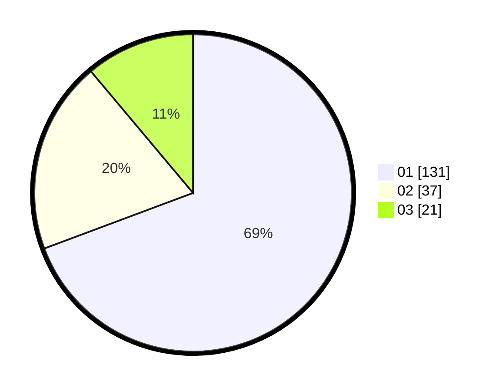

# Hasil

Hasil perolehan suara paslon dapat dilihat pada file paslon-01.txt, paslon-02.txt, dan paslon-03.txt.

Jika tidak ada, artinya data tersebut belum ada pada SIREKAP.

## Perolehan Suara

 * Paslon 01: **131**.
 * Paslon 02: **37**.
 * Paslon 03: **21**.

## Foto C Plano

https://sirekap-obj-formc.kpu.go.id/5987/pemilu/ppwp/31/74/08/10/05/3174081005022-20240214-225236--68c4e346-bfca-4507-be81-e7f2da5b6a6f.jpg

https://sirekap-obj-formc.kpu.go.id/5987/pemilu/ppwp/31/74/08/10/05/3174081005022-20240219-215116--4b262be7-cf37-41ae-8366-3206c5518a30.jpg

https://sirekap-obj-formc.kpu.go.id/5987/pemilu/ppwp/31/74/08/10/05/3174081005022-20240215-013918--ae130815-223f-461e-9ee1-6a04b6cc4a43.jpg

## DATA PEMILIH TETAP

Jumlah pemilih dalam DPT: **211**.
 * L: **104**.
 * P: **107**.

## DATA PENGGUNA HAK PILIH

Jumlah pengguna hak pilih dalam DPT: **186**.
 * L: **88**.
 * P: **98**.

Jumlah pengguna hak pilih dalam DPTb: **6**.
 * L: **4**.
 * P: **2**.

Jumlah pengguna hak pilih dalam DPK: **0**.
 * L: **0**.
 * P: **0**.

Jumlah pengguna hak pilih: **192**.
 * L: **92**.
 * P: **100**.

## JUMLAH SUARA SAH DAN TIDAK SAH

JUMLAH SELURUH SUARA SAH: **189**.

JUMLAH SUARA TIDAK SAH: **3**.

JUMLAH SELURUH SUARA SAH DAN SUARA TIDAK SAH: **192**.
