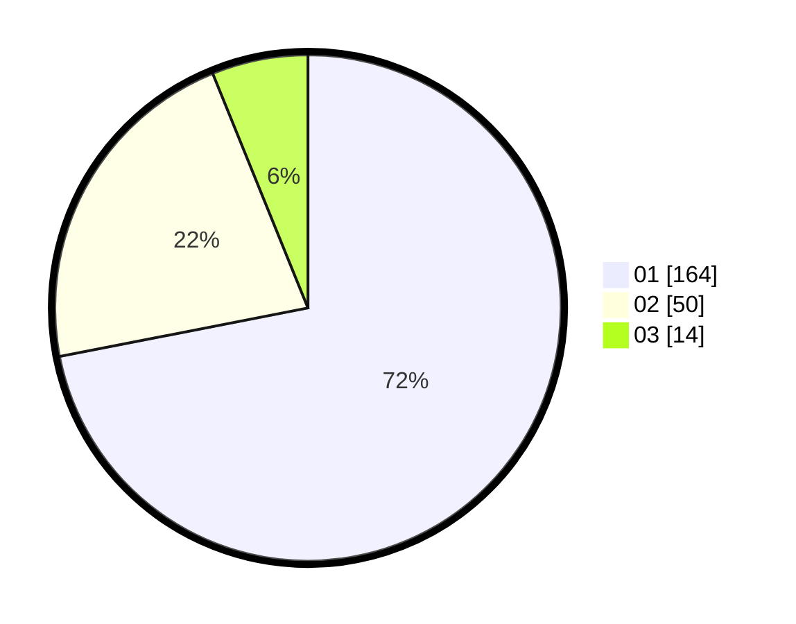

# Hasil

Hasil perolehan suara paslon dapat dilihat pada file paslon-01.txt, paslon-02.txt, dan paslon-03.txt.

Jika tidak ada, artinya data tersebut belum ada pada SIREKAP.

## Perolehan Suara

 * Paslon 01: **164**.
 * Paslon 02: **50**.
 * Paslon 03: **14**.

## Foto C Plano

https://sirekap-obj-formc.kpu.go.id/2e71/pemilu/ppwp/31/74/08/10/05/3174081005023-20240218-185403--cde83485-3fd3-4268-9558-b4aaf929bb79.jpg

https://sirekap-obj-formc.kpu.go.id/2e71/pemilu/ppwp/31/74/08/10/05/3174081005023-20240218-191833--0b62a373-690c-41d3-af12-c04305496454.jpg

https://sirekap-obj-formc.kpu.go.id/2e71/pemilu/ppwp/31/74/08/10/05/3174081005023-20240218-192144--8165e131-4706-4f68-8bc7-45a53a4199e1.jpg

## DATA PEMILIH TETAP

Jumlah pemilih dalam DPT: **245**.
 * L: **130**.
 * P: **115**.

## DATA PENGGUNA HAK PILIH

Jumlah pengguna hak pilih dalam DPT: **225**.
 * L: **118**.
 * P: **107**.

Jumlah pengguna hak pilih dalam DPTb: **5**.
 * L: **4**.
 * P: **1**.

Jumlah pengguna hak pilih dalam DPK: **0**.
 * L: **0**.
 * P: **0**.

Jumlah pengguna hak pilih: **230**.
 * L: **122**.
 * P: **108**.

## JUMLAH SUARA SAH DAN TIDAK SAH

JUMLAH SELURUH SUARA SAH: **228**.

JUMLAH SUARA TIDAK SAH: **2**.

JUMLAH SELURUH SUARA SAH DAN SUARA TIDAK SAH: **230**.
