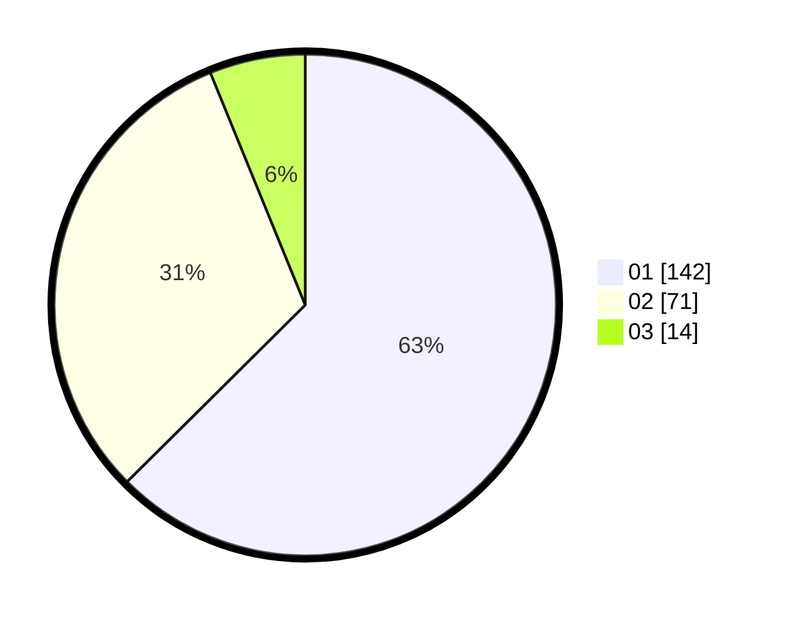

# Hasil

Hasil perolehan suara paslon dapat dilihat pada file paslon-01.txt, paslon-02.txt, dan paslon-03.txt.

Jika tidak ada, artinya data tersebut belum ada pada SIREKAP.

## Perolehan Suara

 * Paslon 01: **142**.
 * Paslon 02: **71**.
 * Paslon 03: **14**.

## Foto C Plano

https://sirekap-obj-formc.kpu.go.id/226d/pemilu/ppwp/31/74/08/10/05/3174081005024-20240214-184948--5ae62ef7-af3e-469a-87b2-4c9a9e3f4231.jpg

https://sirekap-obj-formc.kpu.go.id/226d/pemilu/ppwp/31/74/08/10/05/3174081005024-20240214-185005--ecccbea8-3730-4183-9da5-86d1a459343b.jpg

https://sirekap-obj-formc.kpu.go.id/226d/pemilu/ppwp/31/74/08/10/05/3174081005024-20240214-185021--2e9ad7dd-4fbe-49f2-9359-60c9460c53dd.jpg

## DATA PEMILIH TETAP

Jumlah pemilih dalam DPT: **263**.
 * L: **127**.
 * P: **136**.

## DATA PENGGUNA HAK PILIH

Jumlah pengguna hak pilih dalam DPT: **228**.
 * L: **104**.
 * P: **124**.

Jumlah pengguna hak pilih dalam DPTb: **0**.
 * L: **0**.
 * P: **0**.

Jumlah pengguna hak pilih dalam DPK: **1**.
 * L: **1**.
 * P: **0**.

Jumlah pengguna hak pilih: **229**.
 * L: **105**.
 * P: **124**.

## JUMLAH SUARA SAH DAN TIDAK SAH

JUMLAH SELURUH SUARA SAH: **227**.

JUMLAH SUARA TIDAK SAH: **2**.

JUMLAH SELURUH SUARA SAH DAN SUARA TIDAK SAH: **229**.
