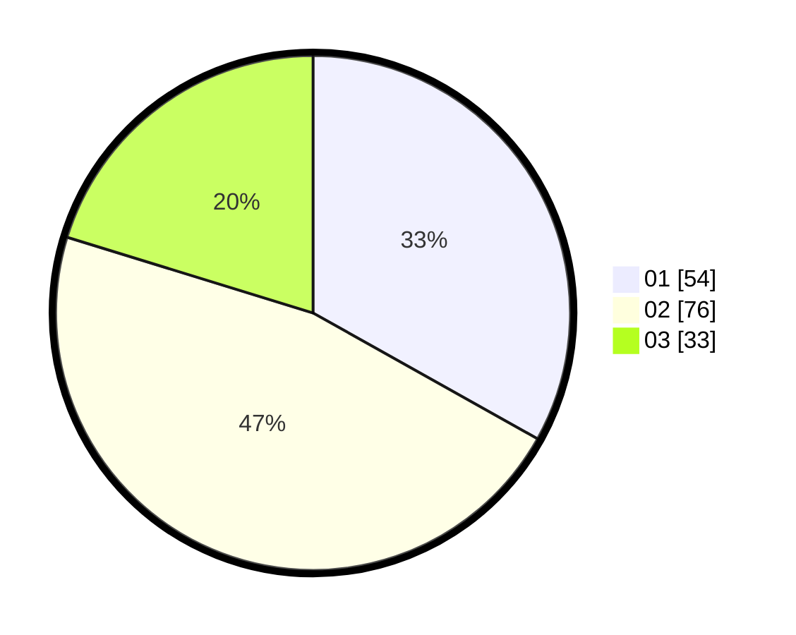

# Hasil

Hasil perolehan suara paslon dapat dilihat pada file paslon-01.txt, paslon-02.txt, dan paslon-03.txt.

Jika tidak ada, artinya data tersebut belum ada pada SIREKAP.

## Perolehan Suara

 * Paslon 01: **54**.
 * Paslon 02: **76**.
 * Paslon 03: **33**.

## Foto C Plano

https://sirekap-obj-formc.kpu.go.id/d8bf/pemilu/ppwp/31/74/08/10/05/3174081005028-20240218-131835--0a2362a0-7e10-4ce7-b27c-e12f48730546.jpg

https://sirekap-obj-formc.kpu.go.id/d8bf/pemilu/ppwp/31/74/08/10/05/3174081005028-20240218-131940--8a5c25fc-ce31-4f70-8523-2ead08c234d2.jpg

https://sirekap-obj-formc.kpu.go.id/d8bf/pemilu/ppwp/31/74/08/10/05/3174081005028-20240218-132043--06700376-5b2e-4964-99e8-a0dd84aa1e33.jpg

## DATA PEMILIH TETAP

Jumlah pemilih dalam DPT: **220**.
 * L: **96**.
 * P: **124**.

## DATA PENGGUNA HAK PILIH

Jumlah pengguna hak pilih dalam DPT: **157**.
 * L: **67**.
 * P: **90**.

Jumlah pengguna hak pilih dalam DPTb: **9**.
 * L: **2**.
 * P: **7**.

Jumlah pengguna hak pilih dalam DPK: **1**.
 * L: **1**.
 * P: **0**.

Jumlah pengguna hak pilih: **167**.
 * L: **70**.
 * P: **97**.

## JUMLAH SUARA SAH DAN TIDAK SAH

JUMLAH SELURUH SUARA SAH: **163**.

JUMLAH SUARA TIDAK SAH: **4**.

JUMLAH SELURUH SUARA SAH DAN SUARA TIDAK SAH: **167**.
