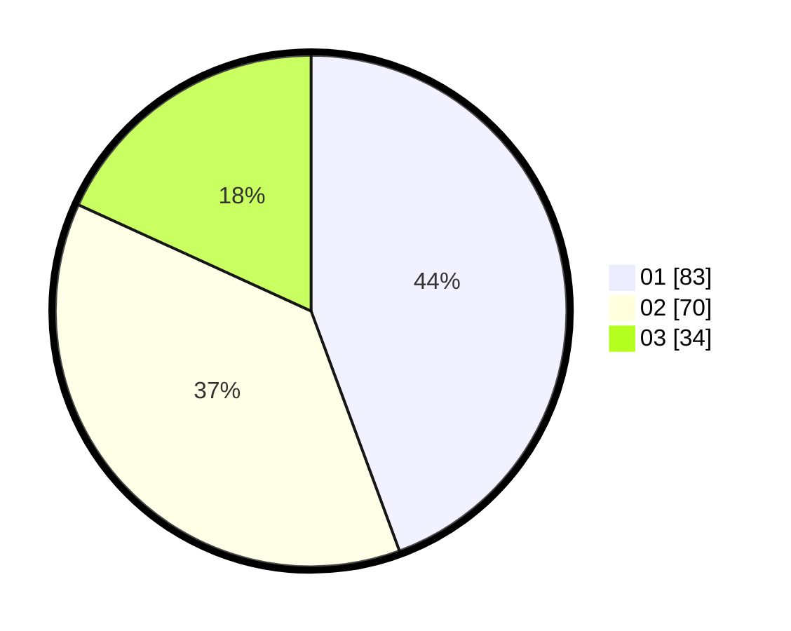

# Hasil

Hasil perolehan suara paslon dapat dilihat pada file paslon-01.txt, paslon-02.txt, dan paslon-03.txt.

Jika tidak ada, artinya data tersebut belum ada pada SIREKAP.

## Perolehan Suara

 * Paslon 01: **83**.
 * Paslon 02: **70**.
 * Paslon 03: **34**.

## Foto C Plano

https://sirekap-obj-formc.kpu.go.id/4ad9/pemilu/ppwp/31/74/08/10/05/3174081005032-20240219-155642--d95776b9-459f-451a-9d4f-99a12842b004.jpg

https://sirekap-obj-formc.kpu.go.id/4ad9/pemilu/ppwp/31/74/08/10/05/3174081005032-20240219-155722--245459ce-7250-4d2e-b2f0-c1d5acab7309.jpg

https://sirekap-obj-formc.kpu.go.id/4ad9/pemilu/ppwp/31/74/08/10/05/3174081005032-20240219-160222--cbfbd4a6-37a5-4965-8e86-26d4337b1156.jpg

## DATA PEMILIH TETAP

Jumlah pemilih dalam DPT: **249**.
 * L: **115**.
 * P: **134**.

## DATA PENGGUNA HAK PILIH

Jumlah pengguna hak pilih dalam DPT: **178**.
 * L: **76**.
 * P: **102**.

Jumlah pengguna hak pilih dalam DPTb: **5**.
 * L: **1**.
 * P: **4**.

Jumlah pengguna hak pilih dalam DPK: **7**.
 * L: **4**.
 * P: **3**.

Jumlah pengguna hak pilih: **190**.
 * L: **81**.
 * P: **109**.

## JUMLAH SUARA SAH DAN TIDAK SAH

JUMLAH SELURUH SUARA SAH: **187**.

JUMLAH SUARA TIDAK SAH: **3**.

JUMLAH SELURUH SUARA SAH DAN SUARA TIDAK SAH: **190**.
