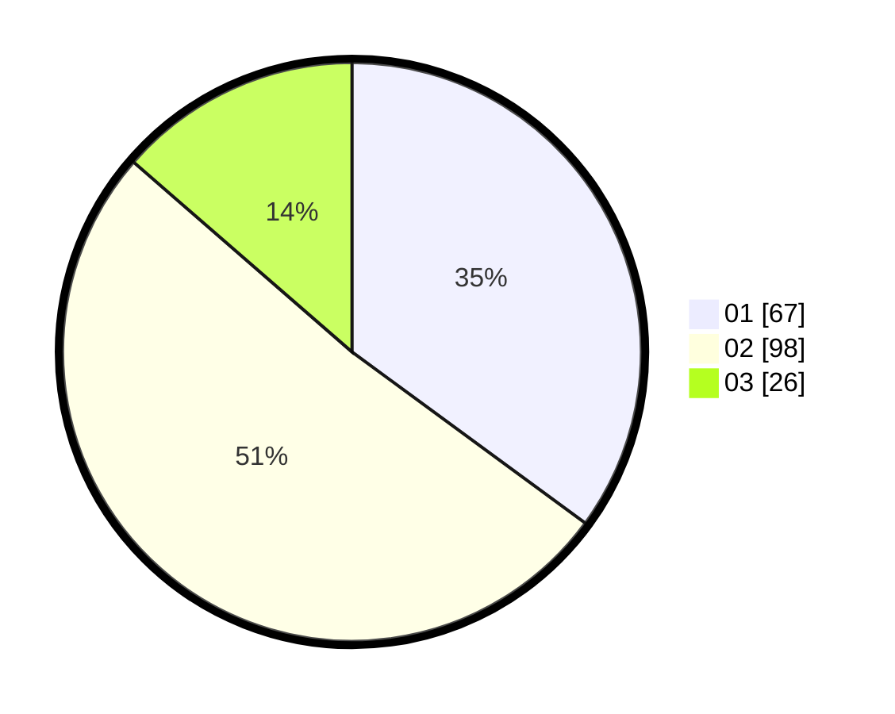

# Hasil

Hasil perolehan suara paslon dapat dilihat pada file paslon-01.txt, paslon-02.txt, dan paslon-03.txt.

Jika tidak ada, artinya data tersebut belum ada pada SIREKAP.

## Perolehan Suara

 * Paslon 01: **67**.
 * Paslon 02: **98**.
 * Paslon 03: **26**.

## Foto C Plano

https://sirekap-obj-formc.kpu.go.id/49e8/pemilu/ppwp/31/74/08/10/05/3174081005035-20240219-112328--54b70c13-62cb-4613-8359-6d3abb563f65.jpg

https://sirekap-obj-formc.kpu.go.id/49e8/pemilu/ppwp/31/74/08/10/05/3174081005035-20240219-112746--6218cfe2-d88e-4202-91df-cc080047da82.jpg

https://sirekap-obj-formc.kpu.go.id/49e8/pemilu/ppwp/31/74/08/10/05/3174081005035-20240219-113149--4d3aaf98-9070-4369-8182-250678180fd1.jpg

## DATA PEMILIH TETAP

Jumlah pemilih dalam DPT: **232**.
 * L: **108**.
 * P: **124**.

## DATA PENGGUNA HAK PILIH

Jumlah pengguna hak pilih dalam DPT: **179**.
 * L: **77**.
 * P: **102**.

Jumlah pengguna hak pilih dalam DPTb: **13**.
 * L: **3**.
 * P: **10**.

Jumlah pengguna hak pilih dalam DPK: **2**.
 * L: **2**.
 * P: **0**.

Jumlah pengguna hak pilih: **194**.
 * L: **82**.
 * P: **112**.

## JUMLAH SUARA SAH DAN TIDAK SAH

JUMLAH SELURUH SUARA SAH: **191**.

JUMLAH SUARA TIDAK SAH: **3**.

JUMLAH SELURUH SUARA SAH DAN SUARA TIDAK SAH: **194**.
