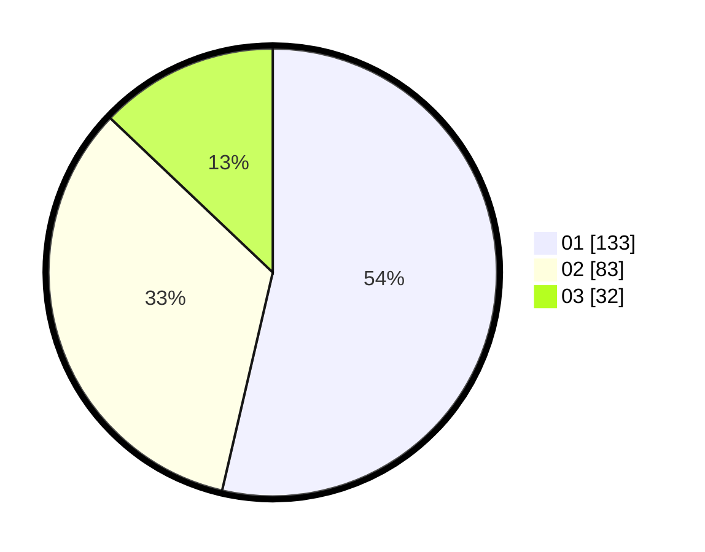

# Hasil

Hasil perolehan suara paslon dapat dilihat pada file paslon-01.txt, paslon-02.txt, dan paslon-03.txt.

Jika tidak ada, artinya data tersebut belum ada pada SIREKAP.

## Perolehan Suara

 * Paslon 01: **133**.
 * Paslon 02: **83**.
 * Paslon 03: **32**.

## Foto C Plano

https://sirekap-obj-formc.kpu.go.id/1429/pemilu/ppwp/31/74/08/10/05/3174081005046-20240219-081349--8a80fb39-4a89-4ce4-b7cf-c555b466cae4.jpg

https://sirekap-obj-formc.kpu.go.id/1429/pemilu/ppwp/31/74/08/10/05/3174081005046-20240219-081611--6038e50d-c05e-4159-bc62-f39e8202a1ea.jpg

https://sirekap-obj-formc.kpu.go.id/1429/pemilu/ppwp/31/74/08/10/05/3174081005046-20240219-081724--ebe63beb-113c-48ae-a891-055e0b6d526a.jpg

## DATA PEMILIH TETAP

Jumlah pemilih dalam DPT: **298**.
 * L: **137**.
 * P: **161**.

## DATA PENGGUNA HAK PILIH

Jumlah pengguna hak pilih dalam DPT: **251**.
 * L: **107**.
 * P: **144**.

Jumlah pengguna hak pilih dalam DPTb: **0**.
 * L: **0**.
 * P: **0**.

Jumlah pengguna hak pilih dalam DPK: **1**.
 * L: **0**.
 * P: **1**.

Jumlah pengguna hak pilih: **252**.
 * L: **107**.
 * P: **145**.

## JUMLAH SUARA SAH DAN TIDAK SAH

JUMLAH SELURUH SUARA SAH: **248**.

JUMLAH SUARA TIDAK SAH: **4**.

JUMLAH SELURUH SUARA SAH DAN SUARA TIDAK SAH: **252**.
