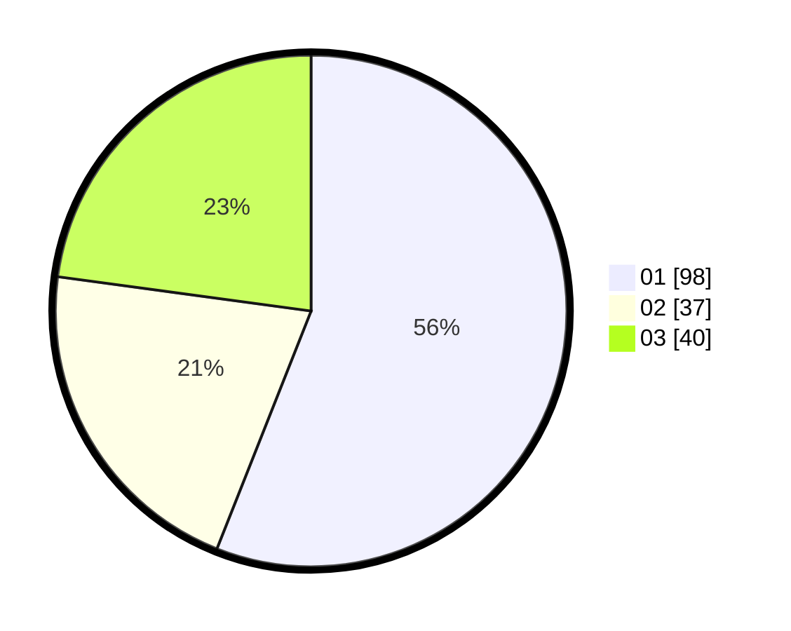

# Hasil

Hasil perolehan suara paslon dapat dilihat pada file paslon-01.txt, paslon-02.txt, dan paslon-03.txt.

Jika tidak ada, artinya data tersebut belum ada pada SIREKAP.

## Perolehan Suara

 * Paslon 01: **98**.
 * Paslon 02: **37**.
 * Paslon 03: **40**.

## Foto C Plano

https://sirekap-obj-formc.kpu.go.id/b8bb/pemilu/ppwp/31/74/08/10/05/3174081005049-20240215-020722--d4e10f88-dbd0-4549-be20-e14da1e59b95.jpg

https://sirekap-obj-formc.kpu.go.id/b8bb/pemilu/ppwp/31/74/08/10/05/3174081005049-20240214-213005--63a6f15a-193d-49e2-ba61-cf77479d62c2.jpg

https://sirekap-obj-formc.kpu.go.id/b8bb/pemilu/ppwp/31/74/08/10/05/3174081005049-20240214-211245--caad9c24-d9d7-4bad-b0c4-3c037d9b793a.jpg

## DATA PEMILIH TETAP

Jumlah pemilih dalam DPT: **207**.
 * L: **98**.
 * P: **109**.

## DATA PENGGUNA HAK PILIH

Jumlah pengguna hak pilih dalam DPT: **161**.
 * L: **76**.
 * P: **85**.

Jumlah pengguna hak pilih dalam DPTb: **17**.
 * L: **2**.
 * P: **15**.

Jumlah pengguna hak pilih dalam DPK: **0**.
 * L: **0**.
 * P: **0**.

Jumlah pengguna hak pilih: **178**.
 * L: **78**.
 * P: **100**.

## JUMLAH SUARA SAH DAN TIDAK SAH

JUMLAH SELURUH SUARA SAH: **175**.

JUMLAH SUARA TIDAK SAH: **3**.

JUMLAH SELURUH SUARA SAH DAN SUARA TIDAK SAH: **178**.
