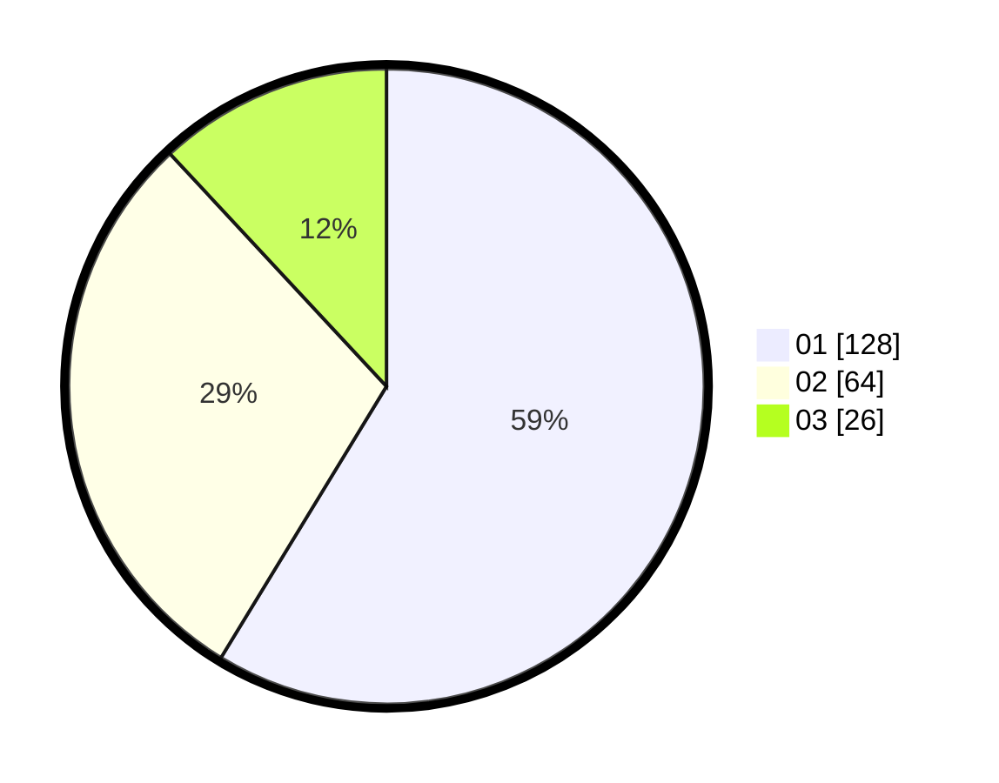

# Hasil

Hasil perolehan suara paslon dapat dilihat pada file paslon-01.txt, paslon-02.txt, dan paslon-03.txt.

Jika tidak ada, artinya data tersebut belum ada pada SIREKAP.

## Perolehan Suara

 * Paslon 01: **128**.
 * Paslon 02: **64**.
 * Paslon 03: **26**.

## Foto C Plano

https://sirekap-obj-formc.kpu.go.id/b360/pemilu/ppwp/31/74/08/10/05/3174081005052-20240219-160248--a75e203f-845a-47c1-b5e6-900fdf6e1e02.jpg

https://sirekap-obj-formc.kpu.go.id/b360/pemilu/ppwp/31/74/08/10/05/3174081005052-20240219-161332--49fe43f5-2ed8-40ce-a968-92ab8eb87cb9.jpg

https://sirekap-obj-formc.kpu.go.id/b360/pemilu/ppwp/31/74/08/10/05/3174081005052-20240219-155606--c9b9c782-ae19-406c-bcae-0d2c82aeca0a.jpg

## DATA PEMILIH TETAP

Jumlah pemilih dalam DPT: **214**.
 * L: **102**.
 * P: **112**.

## DATA PENGGUNA HAK PILIH

Jumlah pengguna hak pilih dalam DPT: **214**.
 * L: **102**.
 * P: **112**.

Jumlah pengguna hak pilih dalam DPTb: **3**.
 * L: **3**.
 * P: **0**.

Jumlah pengguna hak pilih dalam DPK: **1**.
 * L: **0**.
 * P: **1**.

Jumlah pengguna hak pilih: **218**.
 * L: **105**.
 * P: **113**.

## JUMLAH SUARA SAH DAN TIDAK SAH

JUMLAH SELURUH SUARA SAH: **218**.

JUMLAH SUARA TIDAK SAH: **0**.

JUMLAH SELURUH SUARA SAH DAN SUARA TIDAK SAH: **218**.
