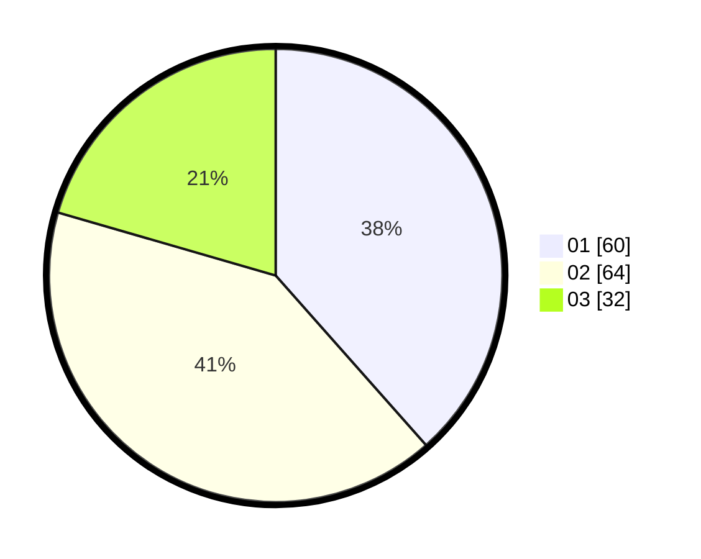

# Hasil

Hasil perolehan suara paslon dapat dilihat pada file paslon-01.txt, paslon-02.txt, dan paslon-03.txt.

Jika tidak ada, artinya data tersebut belum ada pada SIREKAP.

## Perolehan Suara

 * Paslon 01: **60**.
 * Paslon 02: **64**.
 * Paslon 03: **32**.

## Foto C Plano

https://sirekap-obj-formc.kpu.go.id/718b/pemilu/ppwp/31/74/08/10/05/3174081005057-20240214-184646--eafd87f8-075d-4a3f-9bfd-1664074e302f.jpg

https://sirekap-obj-formc.kpu.go.id/718b/pemilu/ppwp/31/74/08/10/05/3174081005057-20240214-184540--9a90ea29-3f11-4e21-a8a6-7b67d608ee60.jpg

https://sirekap-obj-formc.kpu.go.id/718b/pemilu/ppwp/31/74/08/10/05/3174081005057-20240214-184546--e1831968-2565-4c91-ae44-31710691693d.jpg

## DATA PEMILIH TETAP

Jumlah pemilih dalam DPT: **245**.
 * L: **115**.
 * P: **130**.

## DATA PENGGUNA HAK PILIH

Jumlah pengguna hak pilih dalam DPT: **161**.
 * L: **69**.
 * P: **92**.

Jumlah pengguna hak pilih dalam DPTb: **0**.
 * L: **0**.
 * P: **0**.

Jumlah pengguna hak pilih dalam DPK: **0**.
 * L: **0**.
 * P: **0**.

Jumlah pengguna hak pilih: **161**.
 * L: **69**.
 * P: **92**.

## JUMLAH SUARA SAH DAN TIDAK SAH

JUMLAH SELURUH SUARA SAH: **156**.

JUMLAH SUARA TIDAK SAH: **5**.

JUMLAH SELURUH SUARA SAH DAN SUARA TIDAK SAH: **161**.
