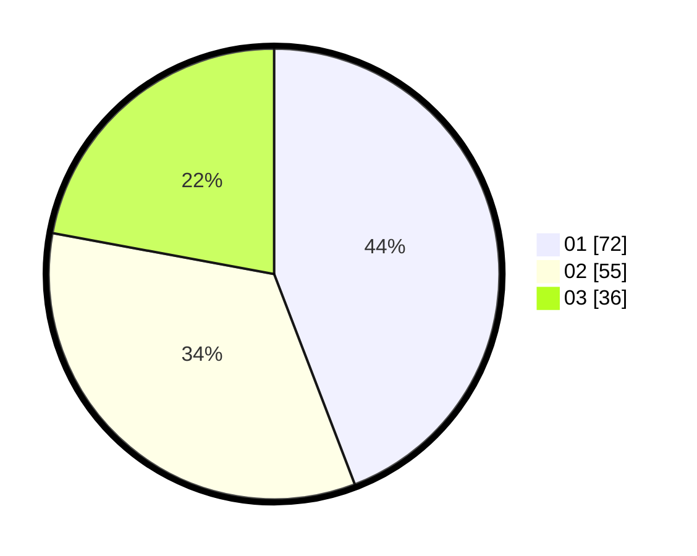

# Hasil

Hasil perolehan suara paslon dapat dilihat pada file paslon-01.txt, paslon-02.txt, dan paslon-03.txt.

Jika tidak ada, artinya data tersebut belum ada pada SIREKAP.

## Perolehan Suara

 * Paslon 01: **72**.
 * Paslon 02: **55**.
 * Paslon 03: **36**.

## Foto C Plano

https://sirekap-obj-formc.kpu.go.id/9a04/pemilu/ppwp/31/74/08/10/05/3174081005069-20240217-212017--e604b8dd-1c1f-41b1-845c-3d5a967913bb.jpg

https://sirekap-obj-formc.kpu.go.id/9a04/pemilu/ppwp/31/74/08/10/05/3174081005069-20240217-214228--22c66119-8813-4569-92d7-b8155f002dc3.jpg

https://sirekap-obj-formc.kpu.go.id/9a04/pemilu/ppwp/31/74/08/10/05/3174081005069-20240217-215218--2d2aec51-1b51-4d4b-83e4-392131a770c0.jpg

## DATA PEMILIH TETAP

Jumlah pemilih dalam DPT: **198**.
 * L: **102**.
 * P: **96**.

## DATA PENGGUNA HAK PILIH

Jumlah pengguna hak pilih dalam DPT: **163**.
 * L: **78**.
 * P: **85**.

Jumlah pengguna hak pilih dalam DPTb: **3**.
 * L: **2**.
 * P: **1**.

Jumlah pengguna hak pilih dalam DPK: **2**.
 * L: **1**.
 * P: **1**.

Jumlah pengguna hak pilih: **168**.
 * L: **81**.
 * P: **87**.

## JUMLAH SUARA SAH DAN TIDAK SAH

JUMLAH SELURUH SUARA SAH: **163**.

JUMLAH SUARA TIDAK SAH: **5**.

JUMLAH SELURUH SUARA SAH DAN SUARA TIDAK SAH: **168**.
