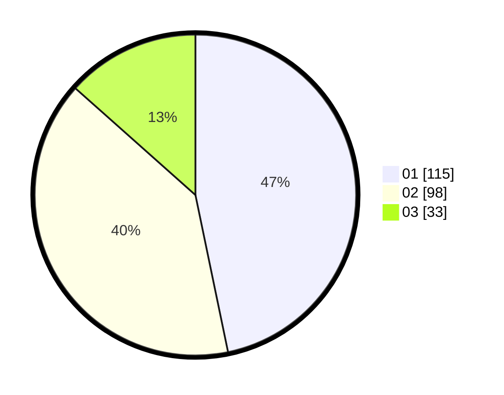

# Hasil

Hasil perolehan suara paslon dapat dilihat pada file paslon-01.txt, paslon-02.txt, dan paslon-03.txt.

Jika tidak ada, artinya data tersebut belum ada pada SIREKAP.

## Perolehan Suara

 * Paslon 01: **115**.
 * Paslon 02: **98**.
 * Paslon 03: **33**.

## Foto C Plano

https://sirekap-obj-formc.kpu.go.id/b0de/pemilu/ppwp/31/74/08/10/05/3174081005074-20240218-132536--70fd7999-fdcf-48f2-bfa9-8d42cae4ed96.jpg

https://sirekap-obj-formc.kpu.go.id/b0de/pemilu/ppwp/31/74/08/10/05/3174081005074-20240218-140227--b1d3c3ee-5b18-4275-8b4f-139c48c54451.jpg

https://sirekap-obj-formc.kpu.go.id/b0de/pemilu/ppwp/31/74/08/10/05/3174081005074-20240218-132842--03e8c78e-b824-474a-8f63-27a3e8898f23.jpg

## DATA PEMILIH TETAP

Jumlah pemilih dalam DPT: **291**.
 * L: **146**.
 * P: **145**.

## DATA PENGGUNA HAK PILIH

Jumlah pengguna hak pilih dalam DPT: **234**.
 * L: **116**.
 * P: **118**.

Jumlah pengguna hak pilih dalam DPTb: **12**.
 * L: **5**.
 * P: **7**.

Jumlah pengguna hak pilih dalam DPK: **2**.
 * L: **1**.
 * P: **1**.

Jumlah pengguna hak pilih: **248**.
 * L: **122**.
 * P: **126**.

## JUMLAH SUARA SAH DAN TIDAK SAH

JUMLAH SELURUH SUARA SAH: **246**.

JUMLAH SUARA TIDAK SAH: **2**.

JUMLAH SELURUH SUARA SAH DAN SUARA TIDAK SAH: **248**.
