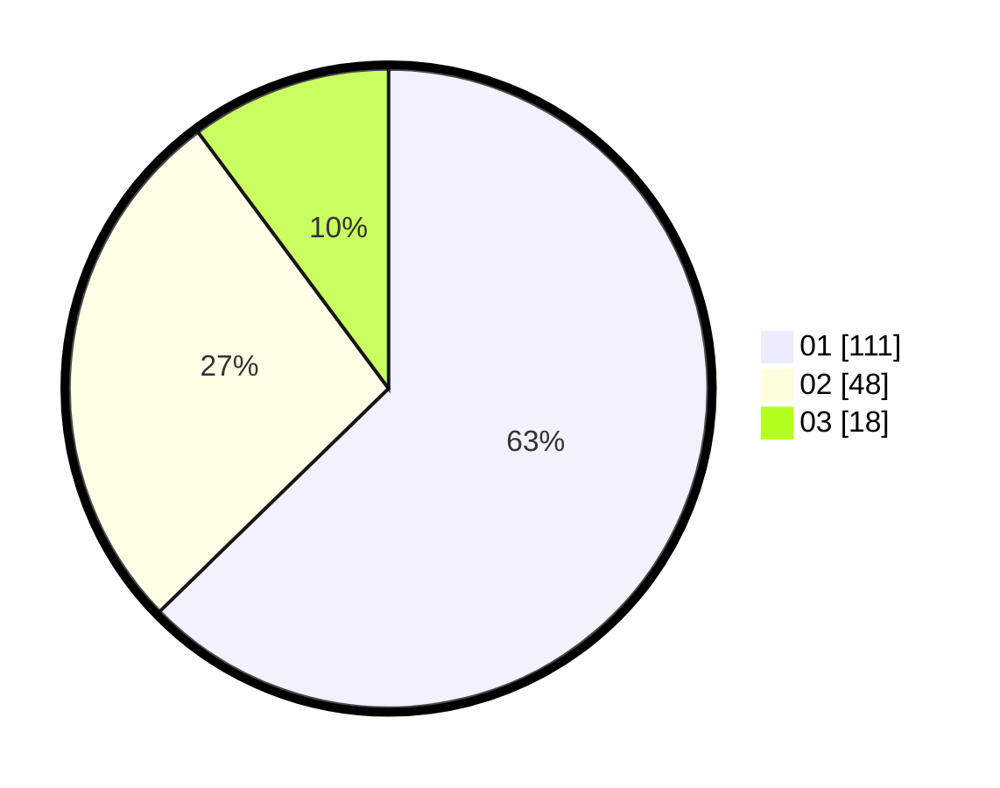

# Hasil

Hasil perolehan suara paslon dapat dilihat pada file paslon-01.txt, paslon-02.txt, dan paslon-03.txt.

Jika tidak ada, artinya data tersebut belum ada pada SIREKAP.

## Perolehan Suara

 * Paslon 01: **111**.
 * Paslon 02: **48**.
 * Paslon 03: **18**.

## Foto C Plano

https://sirekap-obj-formc.kpu.go.id/1bc6/pemilu/ppwp/31/74/08/10/06/3174081006003-20240214-192142--ca0e5b10-2c93-4d98-bff4-5e0c4fbd5be7.jpg

https://sirekap-obj-formc.kpu.go.id/1bc6/pemilu/ppwp/31/74/08/10/06/3174081006003-20240214-192036--0e67fc46-c91d-43ef-9faa-4b2e4e5bc2a9.jpg

https://sirekap-obj-formc.kpu.go.id/1bc6/pemilu/ppwp/31/74/08/10/06/3174081006003-20240214-194303--7ee40c97-8452-4bb2-8964-f1dff9ea256f.jpg

## DATA PEMILIH TETAP

Jumlah pemilih dalam DPT: **222**.
 * L: **119**.
 * P: **103**.

## DATA PENGGUNA HAK PILIH

Jumlah pengguna hak pilih dalam DPT: **168**.
 * L: **86**.
 * P: **82**.

Jumlah pengguna hak pilih dalam DPTb: **8**.
 * L: **3**.
 * P: **5**.

Jumlah pengguna hak pilih dalam DPK: **2**.
 * L: **0**.
 * P: **2**.

Jumlah pengguna hak pilih: **178**.
 * L: **89**.
 * P: **89**.

## JUMLAH SUARA SAH DAN TIDAK SAH

JUMLAH SELURUH SUARA SAH: **177**.

JUMLAH SUARA TIDAK SAH: **1**.

JUMLAH SELURUH SUARA SAH DAN SUARA TIDAK SAH: **178**.
