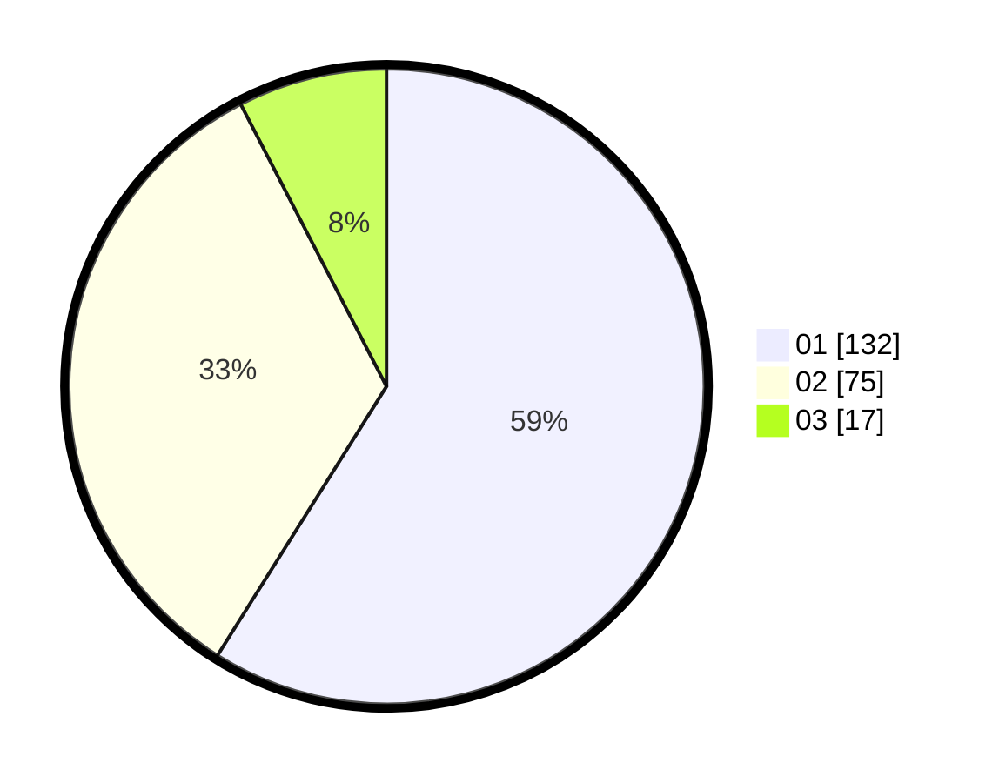

# Hasil

Hasil perolehan suara paslon dapat dilihat pada file paslon-01.txt, paslon-02.txt, dan paslon-03.txt.

Jika tidak ada, artinya data tersebut belum ada pada SIREKAP.

## Perolehan Suara

 * Paslon 01: **132**.
 * Paslon 02: **75**.
 * Paslon 03: **17**.

## Foto C Plano

https://sirekap-obj-formc.kpu.go.id/f1f4/pemilu/ppwp/31/74/08/10/06/3174081006006-20240218-144722--77fb685f-77ac-4a10-99f1-b190b530ec6d.jpg

https://sirekap-obj-formc.kpu.go.id/f1f4/pemilu/ppwp/31/74/08/10/06/3174081006006-20240218-144723--6837d171-37e2-4337-95e2-aca460cd2025.jpg

https://sirekap-obj-formc.kpu.go.id/f1f4/pemilu/ppwp/31/74/08/10/06/3174081006006-20240218-144722--a1b96ccb-cccf-49c5-95d2-fdf42d744a55.jpg

## DATA PEMILIH TETAP

Jumlah pemilih dalam DPT: **0**.
 * L: **0**.
 * P: **0**.

## DATA PENGGUNA HAK PILIH

Jumlah pengguna hak pilih dalam DPT: **0**.
 * L: **0**.
 * P: **0**.

Jumlah pengguna hak pilih dalam DPTb: **0**.
 * L: **0**.
 * P: **0**.

Jumlah pengguna hak pilih dalam DPK: **0**.
 * L: **0**.
 * P: **0**.

Jumlah pengguna hak pilih: **0**.
 * L: **0**.
 * P: **0**.

## JUMLAH SUARA SAH DAN TIDAK SAH

JUMLAH SELURUH SUARA SAH: **224**.

JUMLAH SUARA TIDAK SAH: **6**.

JUMLAH SELURUH SUARA SAH DAN SUARA TIDAK SAH: **230**.
