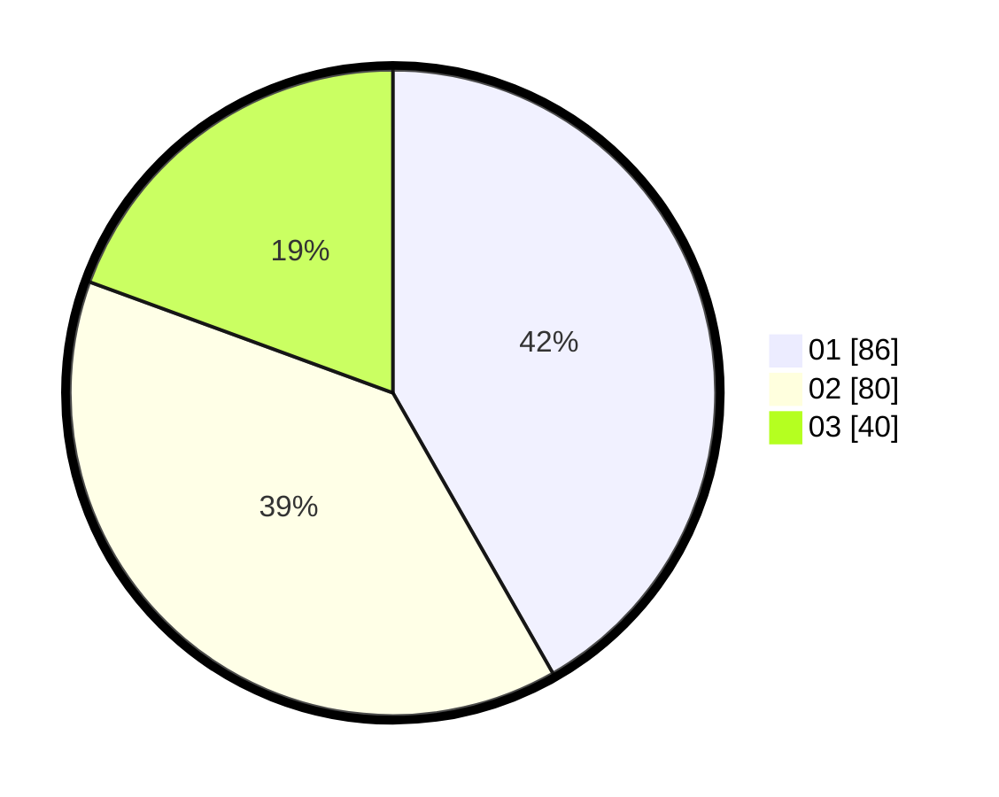

# Hasil

Hasil perolehan suara paslon dapat dilihat pada file paslon-01.txt, paslon-02.txt, dan paslon-03.txt.

Jika tidak ada, artinya data tersebut belum ada pada SIREKAP.

## Perolehan Suara

 * Paslon 01: **86**.
 * Paslon 02: **80**.
 * Paslon 03: **40**.

## Foto C Plano

https://sirekap-obj-formc.kpu.go.id/19ac/pemilu/ppwp/31/74/08/10/06/3174081006010-20240214-155317--707de0b2-9969-400b-993c-f3cffedc2737.jpg

https://sirekap-obj-formc.kpu.go.id/19ac/pemilu/ppwp/31/74/08/10/06/3174081006010-20240214-210645--c9d26d9d-3c6f-47a6-a526-5c7e9a46ab53.jpg

https://sirekap-obj-formc.kpu.go.id/19ac/pemilu/ppwp/31/74/08/10/06/3174081006010-20240214-211023--6eeaaeec-aaab-446b-9843-f55a9da71957.jpg

## DATA PEMILIH TETAP

Jumlah pemilih dalam DPT: **233**.
 * L: **103**.
 * P: **130**.

## DATA PENGGUNA HAK PILIH

Jumlah pengguna hak pilih dalam DPT: **198**.
 * L: **85**.
 * P: **113**.

Jumlah pengguna hak pilih dalam DPTb: **9**.
 * L: **4**.
 * P: **5**.

Jumlah pengguna hak pilih dalam DPK: **1**.
 * L: **1**.
 * P: **0**.

Jumlah pengguna hak pilih: **208**.
 * L: **90**.
 * P: **118**.

## JUMLAH SUARA SAH DAN TIDAK SAH

JUMLAH SELURUH SUARA SAH: **206**.

JUMLAH SUARA TIDAK SAH: **2**.

JUMLAH SELURUH SUARA SAH DAN SUARA TIDAK SAH: **208**.
