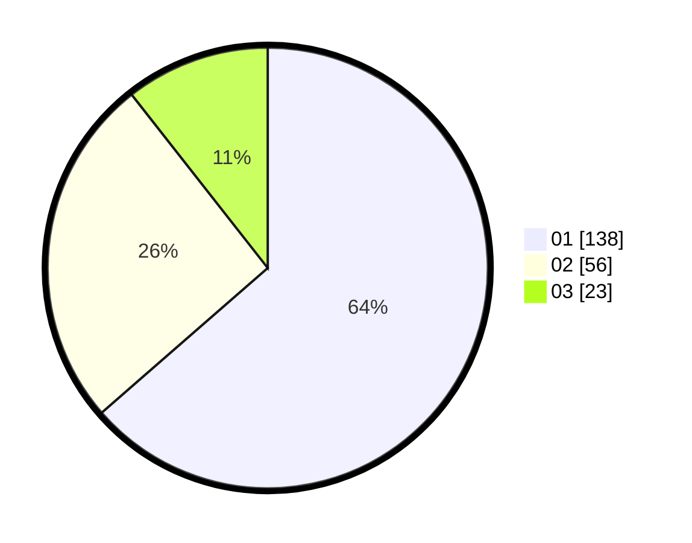

# Hasil

Hasil perolehan suara paslon dapat dilihat pada file paslon-01.txt, paslon-02.txt, dan paslon-03.txt.

Jika tidak ada, artinya data tersebut belum ada pada SIREKAP.

## Perolehan Suara

 * Paslon 01: **138**.
 * Paslon 02: **56**.
 * Paslon 03: **23**.

## Foto C Plano

https://sirekap-obj-formc.kpu.go.id/eab3/pemilu/ppwp/31/74/08/10/06/3174081006016-20240216-210339--3e2e15f1-baa0-4089-a005-dc8e81a95948.jpg

https://sirekap-obj-formc.kpu.go.id/eab3/pemilu/ppwp/31/74/08/10/06/3174081006016-20240216-210340--eb815e1a-069e-41ca-bc9c-9ae2134aa18b.jpg

https://sirekap-obj-formc.kpu.go.id/eab3/pemilu/ppwp/31/74/08/10/06/3174081006016-20240216-210339--04fb5b54-63f3-481f-b423-f057261ba5ca.jpg

## DATA PEMILIH TETAP

Jumlah pemilih dalam DPT: **278**.
 * L: **128**.
 * P: **150**.

## DATA PENGGUNA HAK PILIH

Jumlah pengguna hak pilih dalam DPT: **202**.
 * L: **86**.
 * P: **116**.

Jumlah pengguna hak pilih dalam DPTb: **19**.
 * L: **10**.
 * P: **9**.

Jumlah pengguna hak pilih dalam DPK: **1**.
 * L: **0**.
 * P: **1**.

Jumlah pengguna hak pilih: **222**.
 * L: **96**.
 * P: **126**.

## JUMLAH SUARA SAH DAN TIDAK SAH

JUMLAH SELURUH SUARA SAH: **217**.

JUMLAH SUARA TIDAK SAH: **5**.

JUMLAH SELURUH SUARA SAH DAN SUARA TIDAK SAH: **222**.
