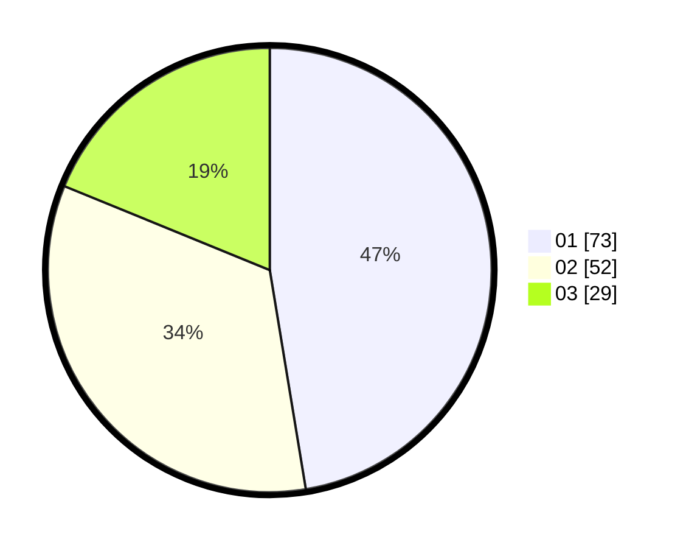

# Hasil

Hasil perolehan suara paslon dapat dilihat pada file paslon-01.txt, paslon-02.txt, dan paslon-03.txt.

Jika tidak ada, artinya data tersebut belum ada pada SIREKAP.

## Perolehan Suara

 * Paslon 01: **73**.
 * Paslon 02: **52**.
 * Paslon 03: **29**.

## Foto C Plano

https://sirekap-obj-formc.kpu.go.id/287d/pemilu/ppwp/31/74/08/10/06/3174081006020-20240214-193519--66e3dfe4-8f93-429b-8ce0-7a59f00d0d2f.jpg

https://sirekap-obj-formc.kpu.go.id/287d/pemilu/ppwp/31/74/08/10/06/3174081006020-20240215-025945--48288317-4c99-4dc7-b4bd-210384453efd.jpg

https://sirekap-obj-formc.kpu.go.id/287d/pemilu/ppwp/31/74/08/10/06/3174081006020-20240215-003351--cf427005-486a-43b5-a8e3-3879d9c27f5e.jpg

## DATA PEMILIH TETAP

Jumlah pemilih dalam DPT: **181**.
 * L: **81**.
 * P: **100**.

## DATA PENGGUNA HAK PILIH

Jumlah pengguna hak pilih dalam DPT: **143**.
 * L: **64**.
 * P: **79**.

Jumlah pengguna hak pilih dalam DPTb: **13**.
 * L: **7**.
 * P: **6**.

Jumlah pengguna hak pilih dalam DPK: **2**.
 * L: **1**.
 * P: **1**.

Jumlah pengguna hak pilih: **158**.
 * L: **72**.
 * P: **86**.

## JUMLAH SUARA SAH DAN TIDAK SAH

JUMLAH SELURUH SUARA SAH: **154**.

JUMLAH SUARA TIDAK SAH: **4**.

JUMLAH SELURUH SUARA SAH DAN SUARA TIDAK SAH: **158**.
