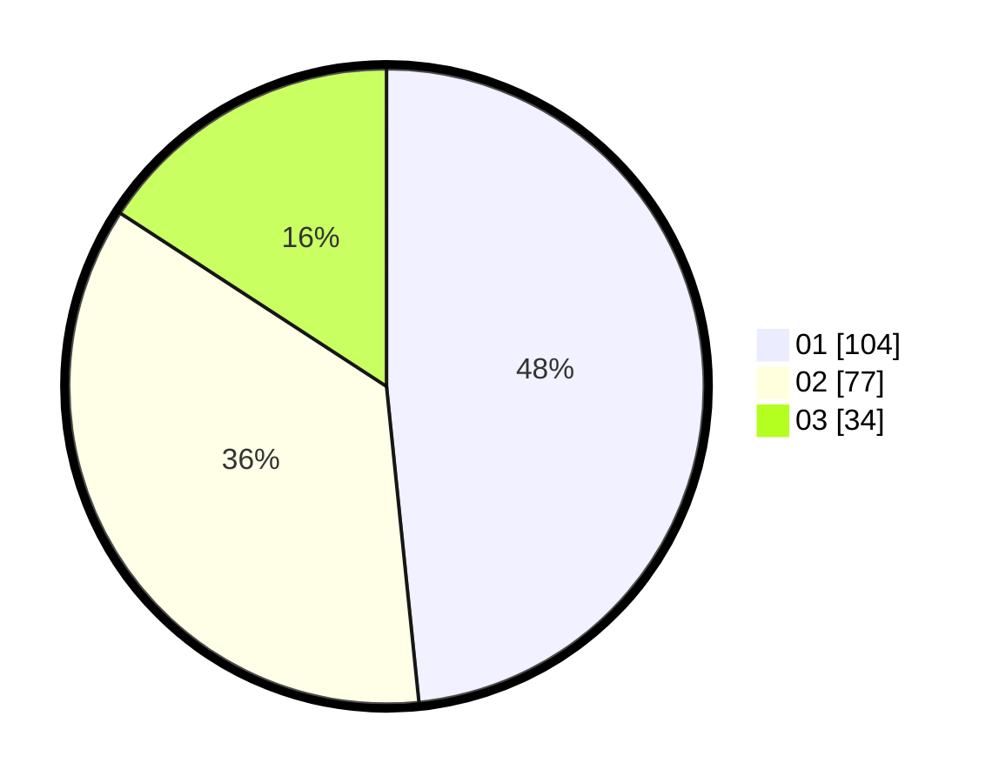

# Hasil

Hasil perolehan suara paslon dapat dilihat pada file paslon-01.txt, paslon-02.txt, dan paslon-03.txt.

Jika tidak ada, artinya data tersebut belum ada pada SIREKAP.

## Perolehan Suara

 * Paslon 01: **104**.
 * Paslon 02: **77**.
 * Paslon 03: **34**.

## Foto C Plano

https://sirekap-obj-formc.kpu.go.id/8475/pemilu/ppwp/31/74/08/10/06/3174081006024-20240216-135112--e2444a74-40c5-49a9-a80b-cf26295fdabf.jpg

https://sirekap-obj-formc.kpu.go.id/8475/pemilu/ppwp/31/74/08/10/06/3174081006024-20240216-135113--7343254f-2148-4b40-bdcd-cad66e3ac4ee.jpg

https://sirekap-obj-formc.kpu.go.id/8475/pemilu/ppwp/31/74/08/10/06/3174081006024-20240216-135112--37585da5-ef0e-44c7-a4fb-8f8a2ee71d53.jpg

## DATA PEMILIH TETAP

Jumlah pemilih dalam DPT: **243**.
 * L: **116**.
 * P: **127**.

## DATA PENGGUNA HAK PILIH

Jumlah pengguna hak pilih dalam DPT: **202**.
 * L: **94**.
 * P: **108**.

Jumlah pengguna hak pilih dalam DPTb: **14**.
 * L: **7**.
 * P: **7**.

Jumlah pengguna hak pilih dalam DPK: **0**.
 * L: **0**.
 * P: **0**.

Jumlah pengguna hak pilih: **216**.
 * L: **101**.
 * P: **115**.

## JUMLAH SUARA SAH DAN TIDAK SAH

JUMLAH SELURUH SUARA SAH: **215**.

JUMLAH SUARA TIDAK SAH: **1**.

JUMLAH SELURUH SUARA SAH DAN SUARA TIDAK SAH: **216**.
