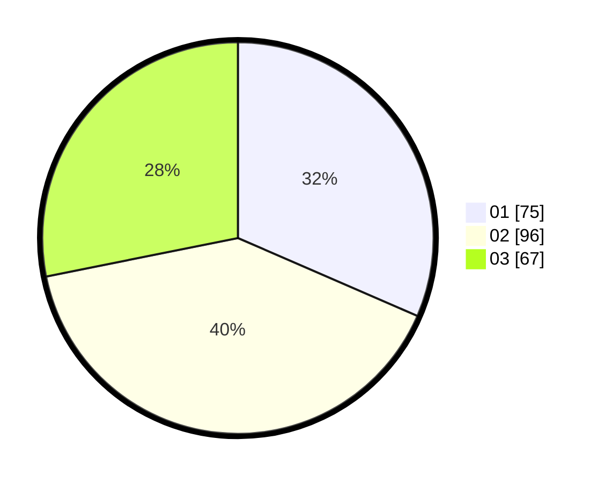

# Hasil

Hasil perolehan suara paslon dapat dilihat pada file paslon-01.txt, paslon-02.txt, dan paslon-03.txt.

Jika tidak ada, artinya data tersebut belum ada pada SIREKAP.

## Perolehan Suara

 * Paslon 01: **75**.
 * Paslon 02: **96**.
 * Paslon 03: **67**.

## Foto C Plano

https://sirekap-obj-formc.kpu.go.id/9490/pemilu/ppwp/31/74/08/10/06/3174081006028-20240216-143001--e1ed169b-ddef-446f-93d0-9abc138f3f9f.jpg

https://sirekap-obj-formc.kpu.go.id/9490/pemilu/ppwp/31/74/08/10/06/3174081006028-20240216-143003--39414f56-a89c-46c9-a1db-80930f6cab32.jpg

https://sirekap-obj-formc.kpu.go.id/9490/pemilu/ppwp/31/74/08/10/06/3174081006028-20240216-143002--cb920a8b-c62f-44e8-a7bc-f45d4dbdcb02.jpg

## DATA PEMILIH TETAP

Jumlah pemilih dalam DPT: **269**.
 * L: **146**.
 * P: **123**.

## DATA PENGGUNA HAK PILIH

Jumlah pengguna hak pilih dalam DPT: **218**.
 * L: **109**.
 * P: **109**.

Jumlah pengguna hak pilih dalam DPTb: **18**.
 * L: **3**.
 * P: **15**.

Jumlah pengguna hak pilih dalam DPK: **4**.
 * L: **2**.
 * P: **2**.

Jumlah pengguna hak pilih: **240**.
 * L: **114**.
 * P: **126**.

## JUMLAH SUARA SAH DAN TIDAK SAH

JUMLAH SELURUH SUARA SAH: **238**.

JUMLAH SUARA TIDAK SAH: **2**.

JUMLAH SELURUH SUARA SAH DAN SUARA TIDAK SAH: **240**.
