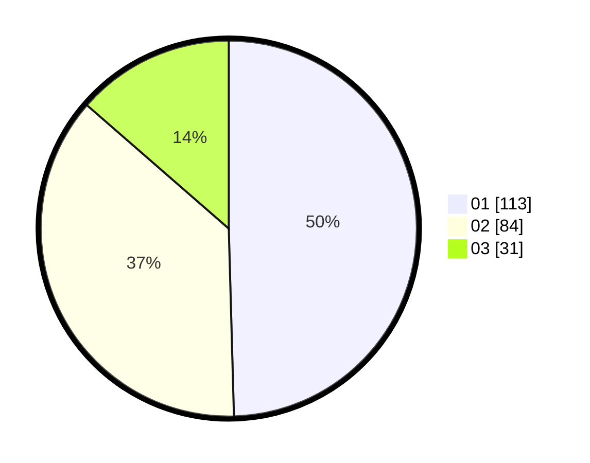

# Hasil

Hasil perolehan suara paslon dapat dilihat pada file paslon-01.txt, paslon-02.txt, dan paslon-03.txt.

Jika tidak ada, artinya data tersebut belum ada pada SIREKAP.

## Perolehan Suara

 * Paslon 01: **113**.
 * Paslon 02: **84**.
 * Paslon 03: **31**.

## Foto C Plano

https://sirekap-obj-formc.kpu.go.id/8bcd/pemilu/ppwp/31/74/08/10/06/3174081006032-20240214-192011--4d540044-76e0-426e-a9ca-32adc6435bc6.jpg

https://sirekap-obj-formc.kpu.go.id/8bcd/pemilu/ppwp/31/74/08/10/06/3174081006032-20240214-192042--ae82e792-3d8d-470b-9ad0-3d73c3572895.jpg

https://sirekap-obj-formc.kpu.go.id/8bcd/pemilu/ppwp/31/74/08/10/06/3174081006032-20240214-192109--1fb9e97d-5dbf-43c9-ad44-d81b2c8fd966.jpg

## DATA PEMILIH TETAP

Jumlah pemilih dalam DPT: **267**.
 * L: **142**.
 * P: **125**.

## DATA PENGGUNA HAK PILIH

Jumlah pengguna hak pilih dalam DPT: **217**.
 * L: **112**.
 * P: **105**.

Jumlah pengguna hak pilih dalam DPTb: **11**.
 * L: **2**.
 * P: **9**.

Jumlah pengguna hak pilih dalam DPK: **1**.
 * L: **0**.
 * P: **1**.

Jumlah pengguna hak pilih: **229**.
 * L: **114**.
 * P: **115**.

## JUMLAH SUARA SAH DAN TIDAK SAH

JUMLAH SELURUH SUARA SAH: **228**.

JUMLAH SUARA TIDAK SAH: **1**.

JUMLAH SELURUH SUARA SAH DAN SUARA TIDAK SAH: **229**.
