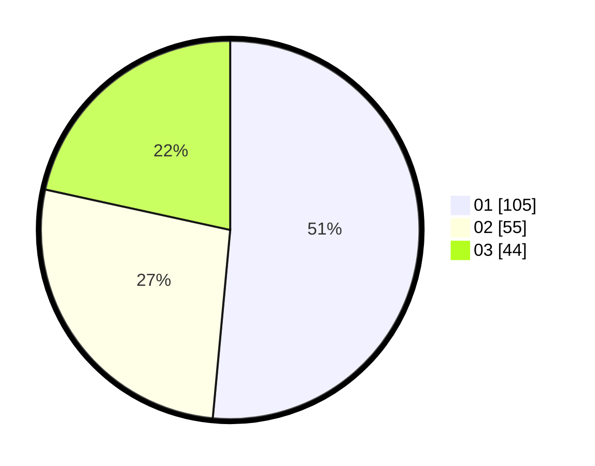

# Hasil

Hasil perolehan suara paslon dapat dilihat pada file paslon-01.txt, paslon-02.txt, dan paslon-03.txt.

Jika tidak ada, artinya data tersebut belum ada pada SIREKAP.

## Perolehan Suara

 * Paslon 01: **105**.
 * Paslon 02: **55**.
 * Paslon 03: **44**.

## Foto C Plano

https://sirekap-obj-formc.kpu.go.id/def0/pemilu/ppwp/31/74/08/10/06/3174081006035-20240214-231938--43fb8880-1d80-4a54-a2de-4fec795e9bb8.jpg

https://sirekap-obj-formc.kpu.go.id/def0/pemilu/ppwp/31/74/08/10/06/3174081006035-20240214-232106--e88728ff-6e86-4386-a369-224b621b7f9c.jpg

https://sirekap-obj-formc.kpu.go.id/def0/pemilu/ppwp/31/74/08/10/06/3174081006035-20240214-193213--af8a9121-20b6-4160-b57e-387b9e153dc0.jpg

## DATA PEMILIH TETAP

Jumlah pemilih dalam DPT: **263**.
 * L: **129**.
 * P: **134**.

## DATA PENGGUNA HAK PILIH

Jumlah pengguna hak pilih dalam DPT: **189**.
 * L: **91**.
 * P: **98**.

Jumlah pengguna hak pilih dalam DPTb: **14**.
 * L: **8**.
 * P: **6**.

Jumlah pengguna hak pilih dalam DPK: **1**.
 * L: **0**.
 * P: **1**.

Jumlah pengguna hak pilih: **204**.
 * L: **99**.
 * P: **105**.

## JUMLAH SUARA SAH DAN TIDAK SAH

JUMLAH SELURUH SUARA SAH: **204**.

JUMLAH SUARA TIDAK SAH: **0**.

JUMLAH SELURUH SUARA SAH DAN SUARA TIDAK SAH: **204**.
