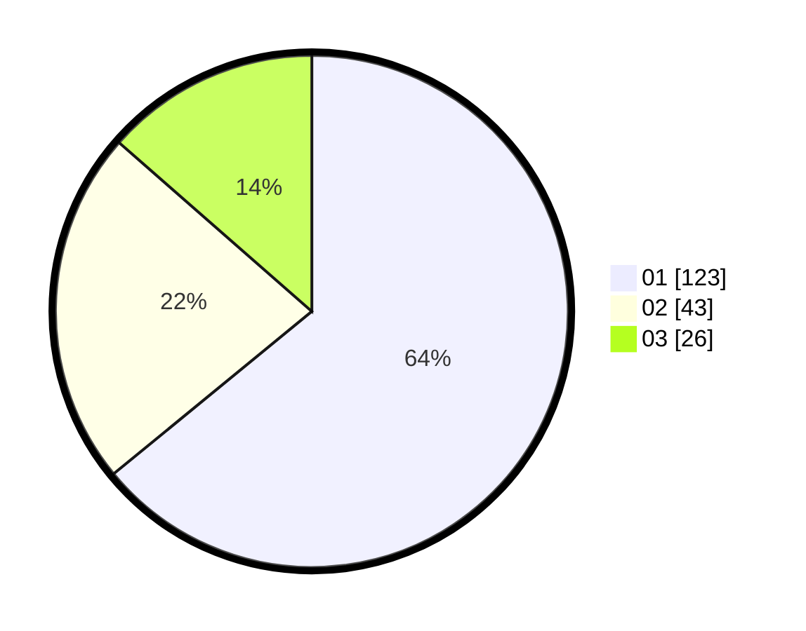

# Hasil

Hasil perolehan suara paslon dapat dilihat pada file paslon-01.txt, paslon-02.txt, dan paslon-03.txt.

Jika tidak ada, artinya data tersebut belum ada pada SIREKAP.

## Perolehan Suara

 * Paslon 01: **123**.
 * Paslon 02: **43**.
 * Paslon 03: **26**.

## Foto C Plano

https://sirekap-obj-formc.kpu.go.id/37d8/pemilu/ppwp/31/74/08/10/06/3174081006037-20240218-104411--7e623ed8-0ef4-4a7a-be4f-8398a6e40e2f.jpg

https://sirekap-obj-formc.kpu.go.id/37d8/pemilu/ppwp/31/74/08/10/06/3174081006037-20240218-104414--bad90752-836d-4429-bda6-1b82cbef29bd.jpg

https://sirekap-obj-formc.kpu.go.id/37d8/pemilu/ppwp/31/74/08/10/06/3174081006037-20240218-104412--966df9c1-cbab-4f8b-83dc-1b34fa8401c6.jpg

## DATA PEMILIH TETAP

Jumlah pemilih dalam DPT: **179**.
 * L: **91**.
 * P: **88**.

## DATA PENGGUNA HAK PILIH

Jumlah pengguna hak pilih dalam DPT: **179**.
 * L: **91**.
 * P: **88**.

Jumlah pengguna hak pilih dalam DPTb: **12**.
 * L: **2**.
 * P: **10**.

Jumlah pengguna hak pilih dalam DPK: **3**.
 * L: **1**.
 * P: **2**.

Jumlah pengguna hak pilih: **194**.
 * L: **94**.
 * P: **100**.

## JUMLAH SUARA SAH DAN TIDAK SAH

JUMLAH SELURUH SUARA SAH: **192**.

JUMLAH SUARA TIDAK SAH: **2**.

JUMLAH SELURUH SUARA SAH DAN SUARA TIDAK SAH: **194**.
