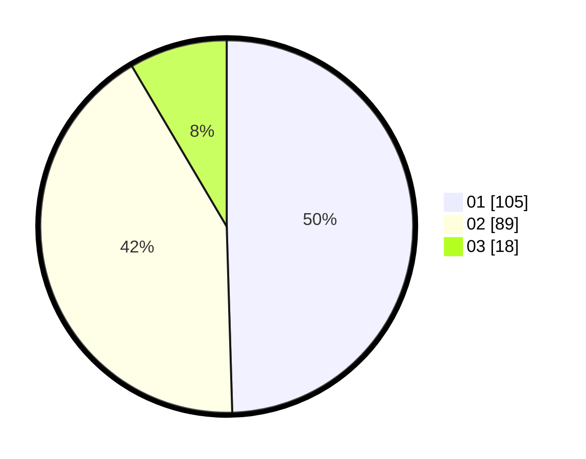

# Hasil

Hasil perolehan suara paslon dapat dilihat pada file paslon-01.txt, paslon-02.txt, dan paslon-03.txt.

Jika tidak ada, artinya data tersebut belum ada pada SIREKAP.

## Perolehan Suara

 * Paslon 01: **105**.
 * Paslon 02: **89**.
 * Paslon 03: **18**.

## Foto C Plano

https://sirekap-obj-formc.kpu.go.id/6377/pemilu/ppwp/31/74/09/10/01/3174091001005-20240214-200250--3b22ff1d-6d54-4b78-9347-3c544877f9a7.jpg

https://sirekap-obj-formc.kpu.go.id/6377/pemilu/ppwp/31/74/09/10/01/3174091001005-20240214-200927--71dc9a93-cb24-4800-80a2-1cdd7701ccde.jpg

https://sirekap-obj-formc.kpu.go.id/6377/pemilu/ppwp/31/74/09/10/01/3174091001005-20240214-201125--57bf3252-07aa-4642-abed-cd282dcda74f.jpg

## DATA PEMILIH TETAP

Jumlah pemilih dalam DPT: **270**.
 * L: **125**.
 * P: **145**.

## DATA PENGGUNA HAK PILIH

Jumlah pengguna hak pilih dalam DPT: **209**.
 * L: **93**.
 * P: **116**.

Jumlah pengguna hak pilih dalam DPTb: **7**.
 * L: **2**.
 * P: **5**.

Jumlah pengguna hak pilih dalam DPK: **1**.
 * L: **1**.
 * P: **0**.

Jumlah pengguna hak pilih: **217**.
 * L: **96**.
 * P: **121**.

## JUMLAH SUARA SAH DAN TIDAK SAH

JUMLAH SELURUH SUARA SAH: **212**.

JUMLAH SUARA TIDAK SAH: **5**.

JUMLAH SELURUH SUARA SAH DAN SUARA TIDAK SAH: **217**.
