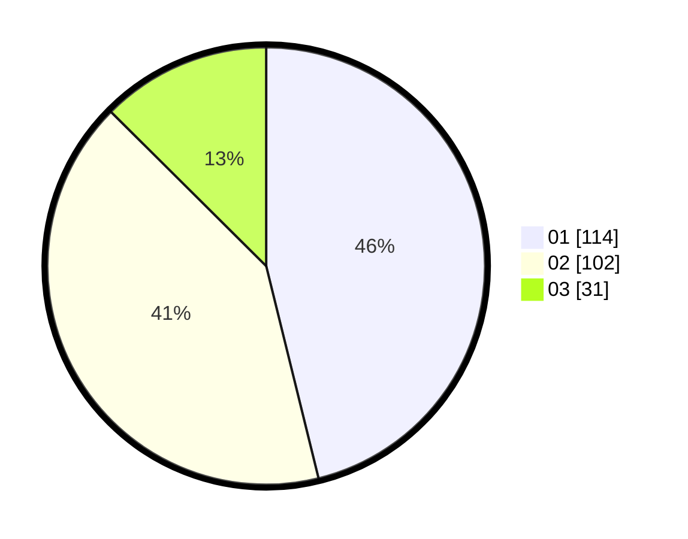

# Hasil

Hasil perolehan suara paslon dapat dilihat pada file paslon-01.txt, paslon-02.txt, dan paslon-03.txt.

Jika tidak ada, artinya data tersebut belum ada pada SIREKAP.

## Perolehan Suara

 * Paslon 01: **114**.
 * Paslon 02: **102**.
 * Paslon 03: **31**.

## Foto C Plano

https://sirekap-obj-formc.kpu.go.id/5deb/pemilu/ppwp/31/74/09/10/01/3174091001010-20240214-194238--6e12661f-1c25-4483-bc1c-e50be552aefe.jpg

https://sirekap-obj-formc.kpu.go.id/5deb/pemilu/ppwp/31/74/09/10/01/3174091001010-20240214-194627--ef72833b-e5e4-44dc-beee-0fe2d511d840.jpg

https://sirekap-obj-formc.kpu.go.id/5deb/pemilu/ppwp/31/74/09/10/01/3174091001010-20240214-194750--1e948f4c-58ec-42d3-9eb8-87f1afd58837.jpg

## DATA PEMILIH TETAP

Jumlah pemilih dalam DPT: **249**.
 * L: **123**.
 * P: **126**.

## DATA PENGGUNA HAK PILIH

Jumlah pengguna hak pilih dalam DPT: **249**.
 * L: **123**.
 * P: **126**.

Jumlah pengguna hak pilih dalam DPTb: **2**.
 * L: **1**.
 * P: **1**.

Jumlah pengguna hak pilih dalam DPK: **1**.
 * L: **0**.
 * P: **1**.

Jumlah pengguna hak pilih: **252**.
 * L: **124**.
 * P: **128**.

## JUMLAH SUARA SAH DAN TIDAK SAH

JUMLAH SELURUH SUARA SAH: **247**.

JUMLAH SUARA TIDAK SAH: **5**.

JUMLAH SELURUH SUARA SAH DAN SUARA TIDAK SAH: **252**.
