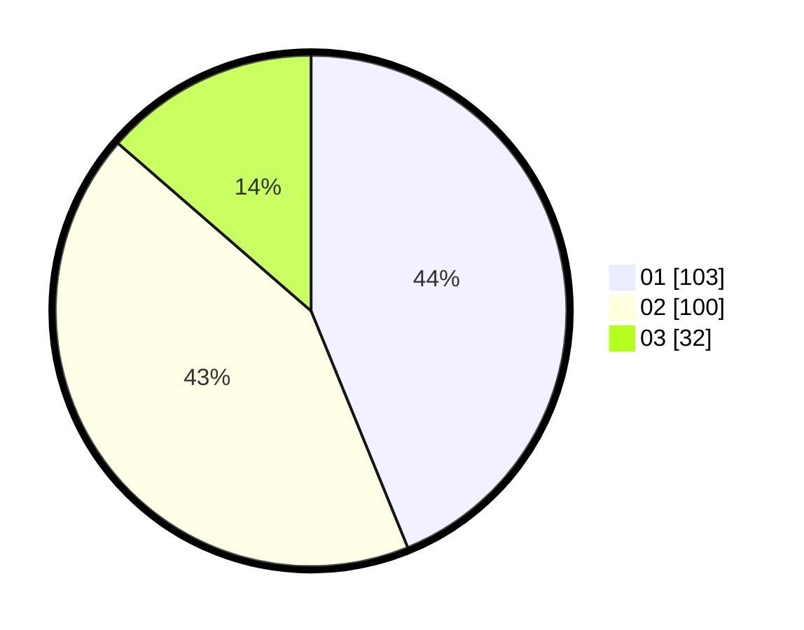

# Hasil

Hasil perolehan suara paslon dapat dilihat pada file paslon-01.txt, paslon-02.txt, dan paslon-03.txt.

Jika tidak ada, artinya data tersebut belum ada pada SIREKAP.

## Perolehan Suara

 * Paslon 01: **103**.
 * Paslon 02: **100**.
 * Paslon 03: **32**.

## Foto C Plano

https://sirekap-obj-formc.kpu.go.id/081c/pemilu/ppwp/31/74/09/10/01/3174091001013-20240214-155429--332e2b8e-c9a1-4321-94fd-9b5689e97604.jpg

https://sirekap-obj-formc.kpu.go.id/081c/pemilu/ppwp/31/74/09/10/01/3174091001013-20240214-155438--9c63d012-bcf8-4742-92e0-83b607f8e23a.jpg

https://sirekap-obj-formc.kpu.go.id/081c/pemilu/ppwp/31/74/09/10/01/3174091001013-20240214-155444--07342ac3-d33d-4137-8747-885d66256056.jpg

## DATA PEMILIH TETAP

Jumlah pemilih dalam DPT: **275**.
 * L: **141**.
 * P: **134**.

## DATA PENGGUNA HAK PILIH

Jumlah pengguna hak pilih dalam DPT: **236**.
 * L: **118**.
 * P: **118**.

Jumlah pengguna hak pilih dalam DPTb: **0**.
 * L: **0**.
 * P: **0**.

Jumlah pengguna hak pilih dalam DPK: **1**.
 * L: **1**.
 * P: **0**.

Jumlah pengguna hak pilih: **237**.
 * L: **119**.
 * P: **118**.

## JUMLAH SUARA SAH DAN TIDAK SAH

JUMLAH SELURUH SUARA SAH: **235**.

JUMLAH SUARA TIDAK SAH: **2**.

JUMLAH SELURUH SUARA SAH DAN SUARA TIDAK SAH: **237**.
