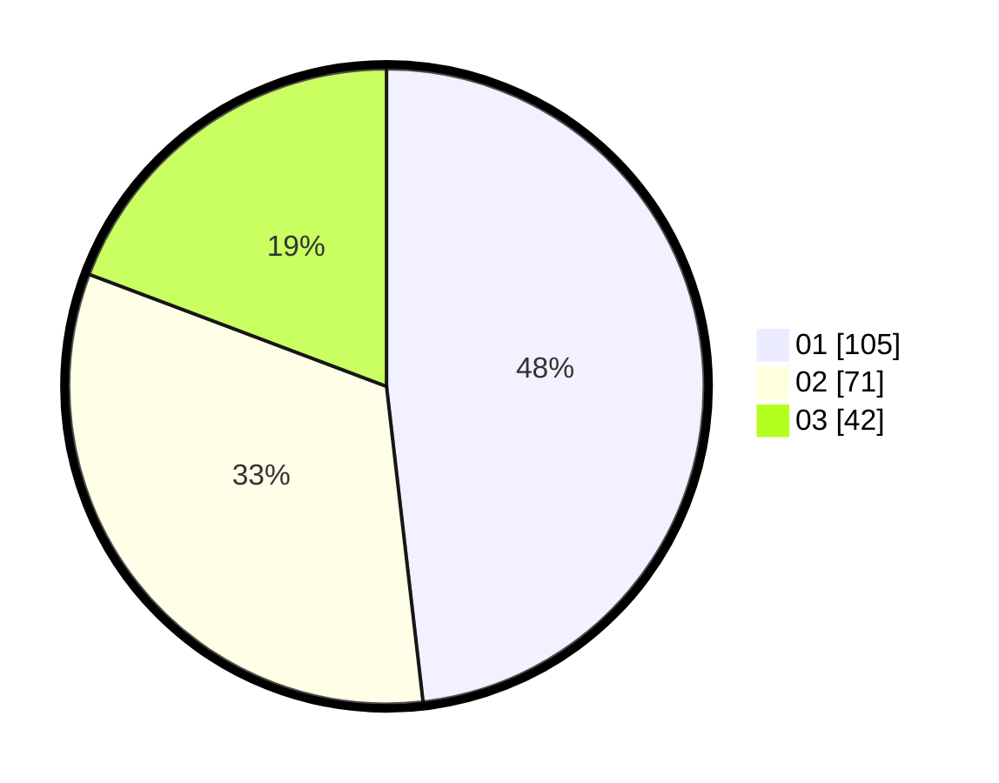

# Hasil

Hasil perolehan suara paslon dapat dilihat pada file paslon-01.txt, paslon-02.txt, dan paslon-03.txt.

Jika tidak ada, artinya data tersebut belum ada pada SIREKAP.

## Perolehan Suara

 * Paslon 01: **105**.
 * Paslon 02: **71**.
 * Paslon 03: **42**.

## Foto C Plano

https://sirekap-obj-formc.kpu.go.id/6dff/pemilu/ppwp/31/74/09/10/01/3174091001014-20240216-142219--4fe19b70-3959-484d-8f82-d084249cc28f.jpg

https://sirekap-obj-formc.kpu.go.id/6dff/pemilu/ppwp/31/74/09/10/01/3174091001014-20240216-142221--5e4010f3-422c-44e1-97f2-e312eb85579d.jpg

https://sirekap-obj-formc.kpu.go.id/6dff/pemilu/ppwp/31/74/09/10/01/3174091001014-20240216-142220--6980d34c-50de-4c56-94fd-eb8b66bc89d0.jpg

## DATA PEMILIH TETAP

Jumlah pemilih dalam DPT: **270**.
 * L: **137**.
 * P: **133**.

## DATA PENGGUNA HAK PILIH

Jumlah pengguna hak pilih dalam DPT: **215**.
 * L: **109**.
 * P: **106**.

Jumlah pengguna hak pilih dalam DPTb: **0**.
 * L: **0**.
 * P: **0**.

Jumlah pengguna hak pilih dalam DPK: **3**.
 * L: **1**.
 * P: **2**.

Jumlah pengguna hak pilih: **218**.
 * L: **110**.
 * P: **108**.

## JUMLAH SUARA SAH DAN TIDAK SAH

JUMLAH SELURUH SUARA SAH: **218**.

JUMLAH SUARA TIDAK SAH: **0**.

JUMLAH SELURUH SUARA SAH DAN SUARA TIDAK SAH: **218**.
