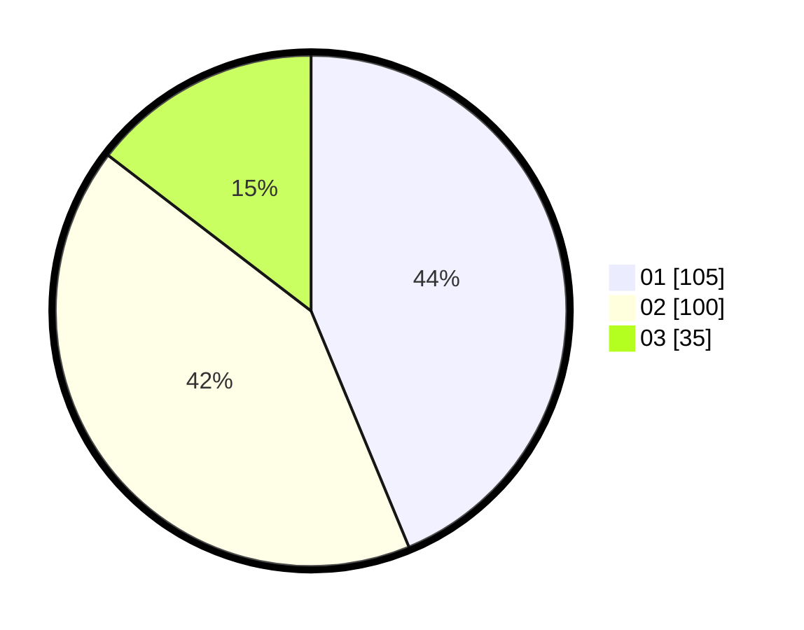

# Hasil

Hasil perolehan suara paslon dapat dilihat pada file paslon-01.txt, paslon-02.txt, dan paslon-03.txt.

Jika tidak ada, artinya data tersebut belum ada pada SIREKAP.

## Perolehan Suara

 * Paslon 01: **105**.
 * Paslon 02: **100**.
 * Paslon 03: **35**.

## Foto C Plano

https://sirekap-obj-formc.kpu.go.id/5395/pemilu/ppwp/31/74/09/10/01/3174091001015-20240215-021947--b681e229-a259-4cf4-80ce-d007a03a459f.jpg

https://sirekap-obj-formc.kpu.go.id/5395/pemilu/ppwp/31/74/09/10/01/3174091001015-20240215-022401--ba57b178-2f06-4679-bdc3-f60109869f9f.jpg

https://sirekap-obj-formc.kpu.go.id/5395/pemilu/ppwp/31/74/09/10/01/3174091001015-20240215-022435--8df5ffdb-1eb9-4378-a102-f8a006d569af.jpg

## DATA PEMILIH TETAP

Jumlah pemilih dalam DPT: **288**.
 * L: **141**.
 * P: **147**.

## DATA PENGGUNA HAK PILIH

Jumlah pengguna hak pilih dalam DPT: **231**.
 * L: **107**.
 * P: **124**.

Jumlah pengguna hak pilih dalam DPTb: **7**.
 * L: **3**.
 * P: **4**.

Jumlah pengguna hak pilih dalam DPK: **6**.
 * L: **4**.
 * P: **2**.

Jumlah pengguna hak pilih: **244**.
 * L: **114**.
 * P: **150**.

## JUMLAH SUARA SAH DAN TIDAK SAH

JUMLAH SELURUH SUARA SAH: **240**.

JUMLAH SUARA TIDAK SAH: **4**.

JUMLAH SELURUH SUARA SAH DAN SUARA TIDAK SAH: **244**.
