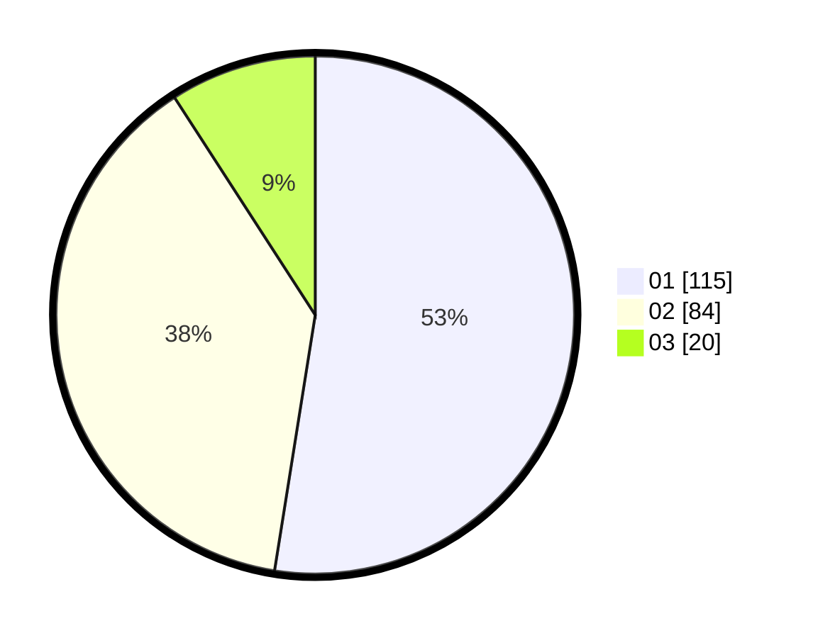

# Hasil

Hasil perolehan suara paslon dapat dilihat pada file paslon-01.txt, paslon-02.txt, dan paslon-03.txt.

Jika tidak ada, artinya data tersebut belum ada pada SIREKAP.

## Perolehan Suara

 * Paslon 01: **115**.
 * Paslon 02: **84**.
 * Paslon 03: **20**.

## Foto C Plano

https://sirekap-obj-formc.kpu.go.id/8efd/pemilu/ppwp/31/74/09/10/01/3174091001018-20240214-155236--ff41dfcd-85bd-43d8-bcbe-92bb702939a8.jpg

https://sirekap-obj-formc.kpu.go.id/8efd/pemilu/ppwp/31/74/09/10/01/3174091001018-20240214-192048--35096462-ab80-434b-a320-b4b183565945.jpg

https://sirekap-obj-formc.kpu.go.id/8efd/pemilu/ppwp/31/74/09/10/01/3174091001018-20240214-205456--2a3dcae0-65c6-4d11-8f15-c23ff5303b50.jpg

## DATA PEMILIH TETAP

Jumlah pemilih dalam DPT: **269**.
 * L: **131**.
 * P: **138**.

## DATA PENGGUNA HAK PILIH

Jumlah pengguna hak pilih dalam DPT: **217**.
 * L: **101**.
 * P: **116**.

Jumlah pengguna hak pilih dalam DPTb: **4**.
 * L: **2**.
 * P: **2**.

Jumlah pengguna hak pilih dalam DPK: **1**.
 * L: **1**.
 * P: **0**.

Jumlah pengguna hak pilih: **222**.
 * L: **104**.
 * P: **118**.

## JUMLAH SUARA SAH DAN TIDAK SAH

JUMLAH SELURUH SUARA SAH: **219**.

JUMLAH SUARA TIDAK SAH: **3**.

JUMLAH SELURUH SUARA SAH DAN SUARA TIDAK SAH: **222**.
