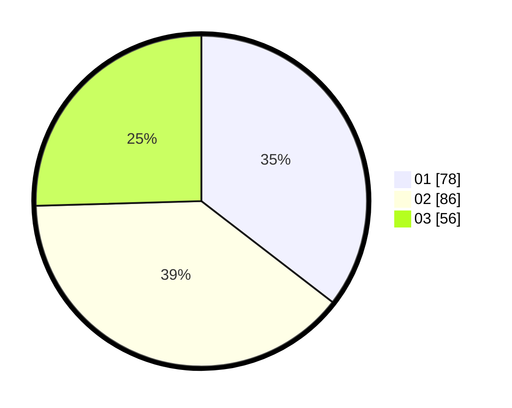

# Hasil

Hasil perolehan suara paslon dapat dilihat pada file paslon-01.txt, paslon-02.txt, dan paslon-03.txt.

Jika tidak ada, artinya data tersebut belum ada pada SIREKAP.

## Perolehan Suara

 * Paslon 01: **78**.
 * Paslon 02: **86**.
 * Paslon 03: **56**.

## Foto C Plano

https://sirekap-obj-formc.kpu.go.id/593d/pemilu/ppwp/31/74/09/10/01/3174091001021-20240216-091014--c7d3faf2-d66c-4c48-af77-e80ea7391c89.jpg

https://sirekap-obj-formc.kpu.go.id/593d/pemilu/ppwp/31/74/09/10/01/3174091001021-20240216-091016--b5ad069a-3253-40c1-838a-7799db1b60ff.jpg

https://sirekap-obj-formc.kpu.go.id/593d/pemilu/ppwp/31/74/09/10/01/3174091001021-20240216-070542--65c40c19-278a-4193-8175-41693ed11230.jpg

## DATA PEMILIH TETAP

Jumlah pemilih dalam DPT: **274**.
 * L: **138**.
 * P: **136**.

## DATA PENGGUNA HAK PILIH

Jumlah pengguna hak pilih dalam DPT: **218**.
 * L: **104**.
 * P: **114**.

Jumlah pengguna hak pilih dalam DPTb: **4**.
 * L: **1**.
 * P: **3**.

Jumlah pengguna hak pilih dalam DPK: **1**.
 * L: **0**.
 * P: **1**.

Jumlah pengguna hak pilih: **223**.
 * L: **105**.
 * P: **118**.

## JUMLAH SUARA SAH DAN TIDAK SAH

JUMLAH SELURUH SUARA SAH: **220**.

JUMLAH SUARA TIDAK SAH: **3**.

JUMLAH SELURUH SUARA SAH DAN SUARA TIDAK SAH: **223**.
